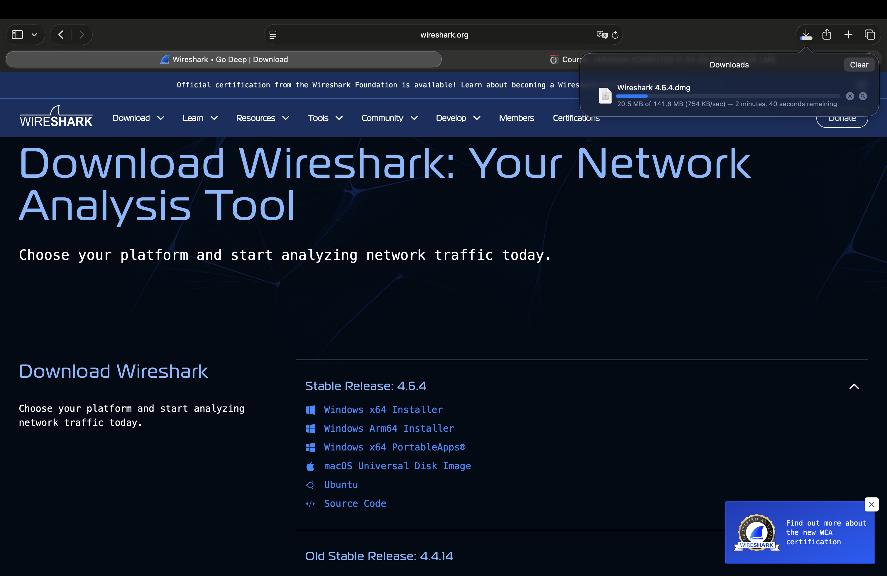
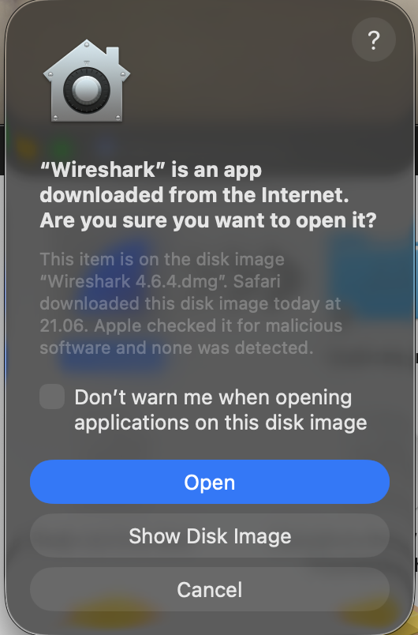
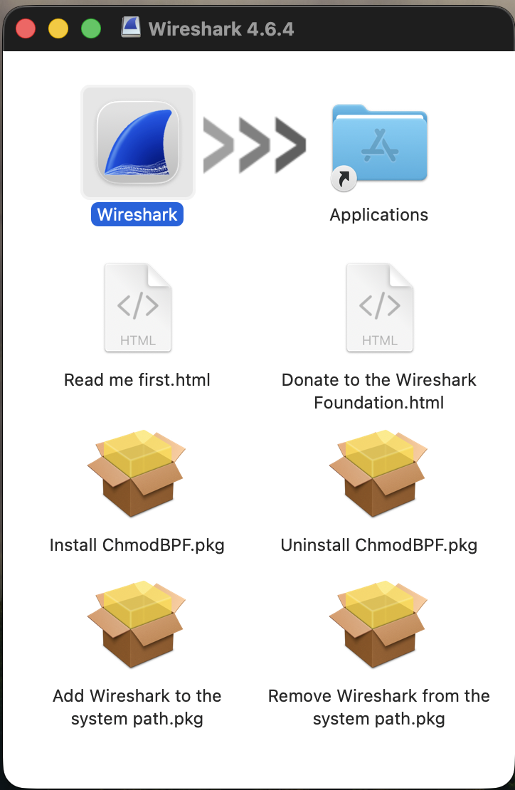
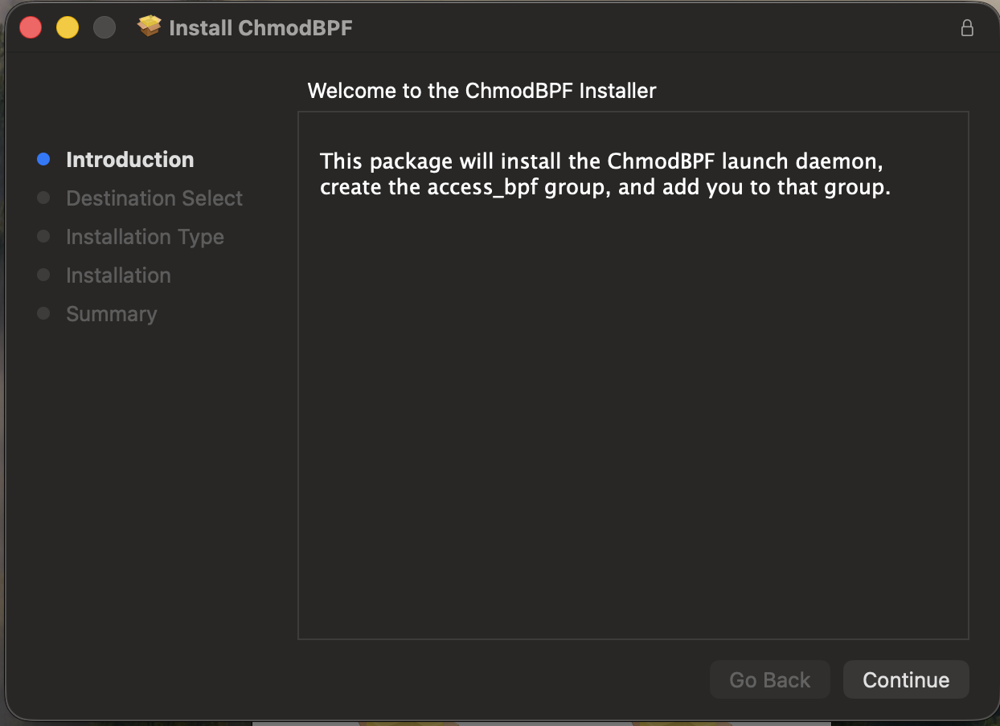
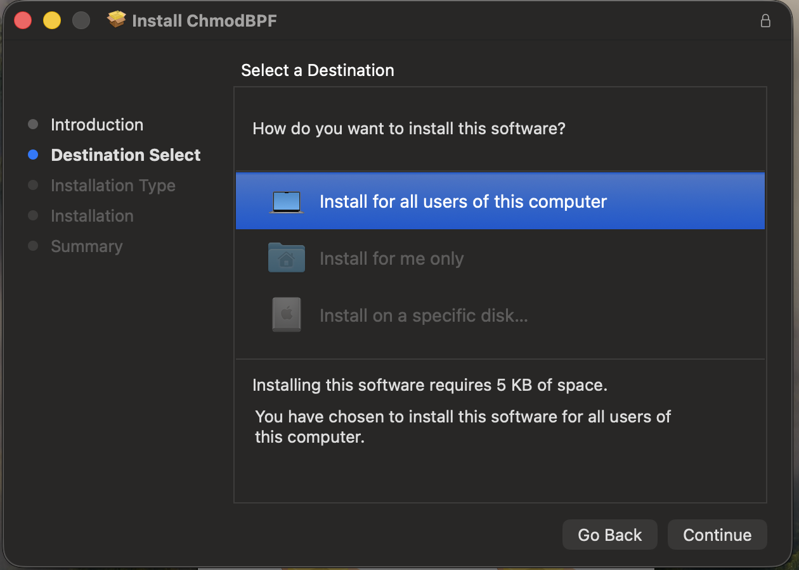
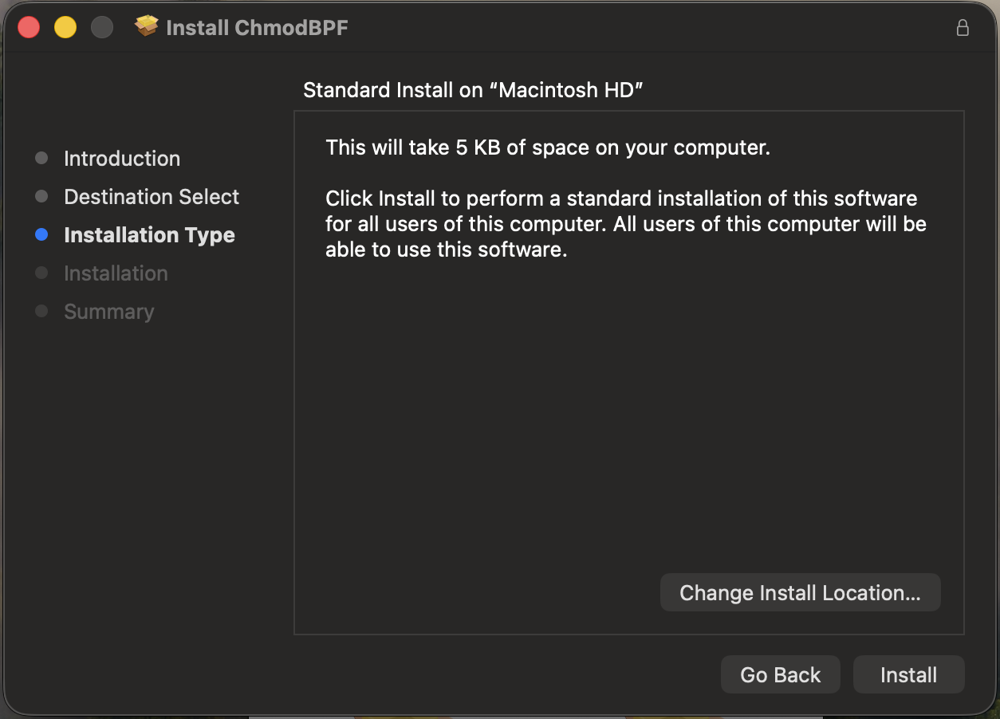
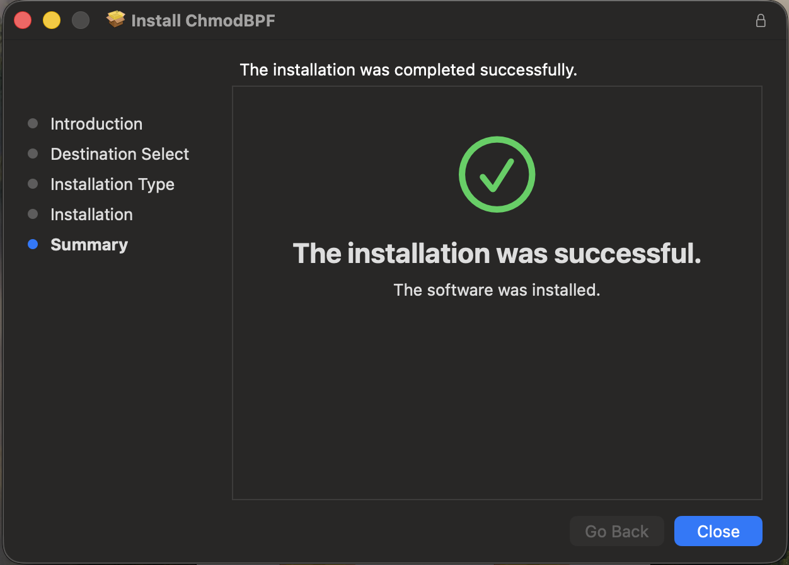
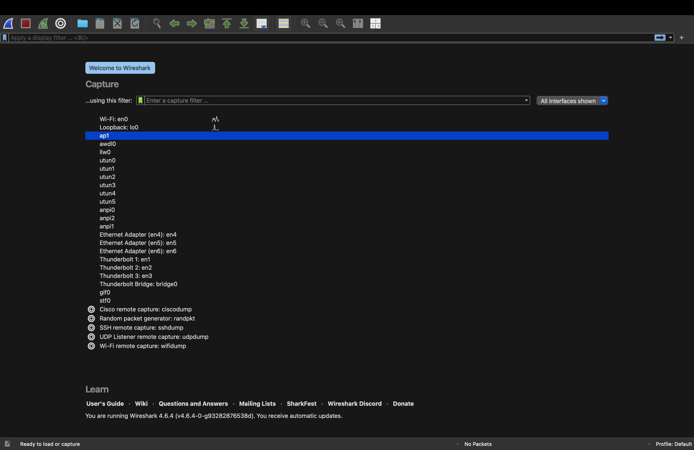
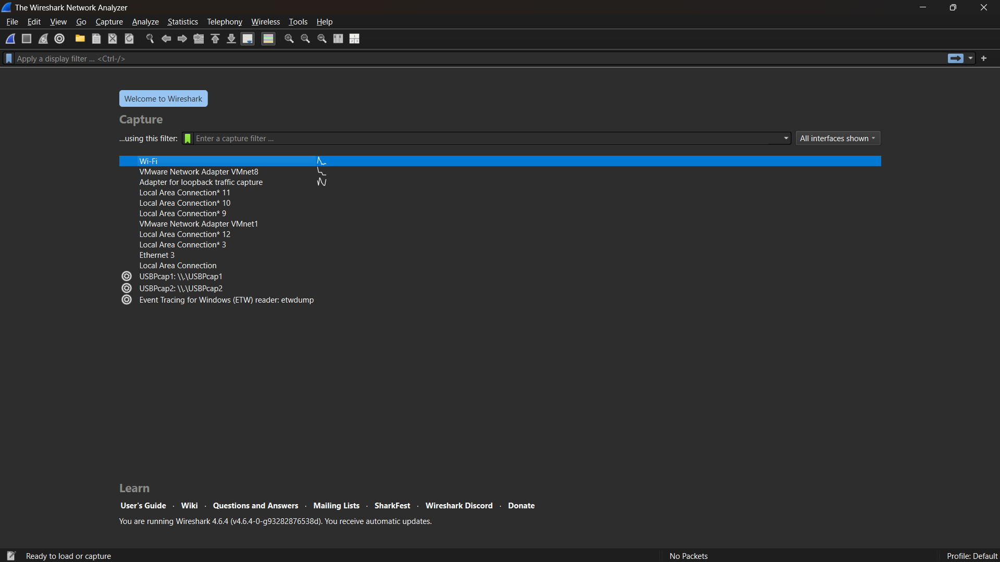
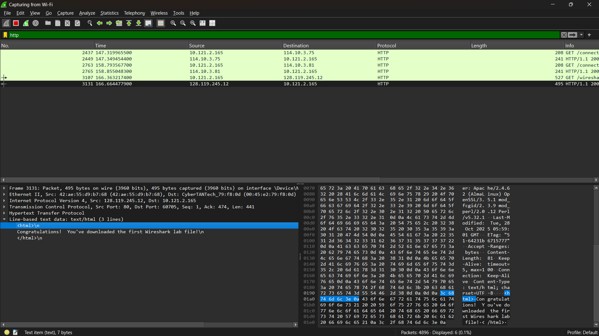

# Laporan Praktikum Jaringan Komputer

## Tujuan Praktikum
Download dan Installasi Wireshark dan Mempelajari Tools Wireshark

## Modul 1 - Langkah Download dan Install Wireshark
1. Download Wireshark terlebih dahulu dengan menggunakan link berikut ini : [Download Wireshark](http://www.wireshark.org/) 
    
   Pilih Wireshark yang sesuai dengan laptop. Lalu klik, otomatis akan terdownload seperti gambar diatas

2. Setelah downnload selesai lakukan installasi Wireshark di laptop, dengan cara klik dua kali file yang telah kalian download 
    
   Pilih open
    
   Geser Wireshark ke application dan juga lakukan intsall ChmodBPF.pkg

3. Tampilan setelah klik install ChmodBPF.pkg 
    
   Pilih continue
   <nr>
   Pilih continue lagi
    
   Pilih install
    
   Tampilan akhir akan seperti ini setelah install ChmodBPF.pkg, lalu klik close

4. Masuk ke aplikasi Wireshark, tampilannya akan seperti ini
   

## Modul 2 - langkah Menjalankan Wireshark
1. Tampilan awal masuk akan seperti gambar berikut ini:
   

2. Karena laptop saya terhubung ke internet menggunakan Wifi, maka interface yang saya pilih di Wireshark adalah Wifi. Interface ini saya pilih agar semua paket data yang masuk dan keluar melalui jaringan Wifi dapat ditangkap dan dianalisis oleh Wireshark.

3. Setelah memilih interface Wifi dan memulai proses capture, Wireshark mulai menampilkan paket data yang masuk dan keluar dari laptop saya secara real-time.
   

4. Untuk langkah percobaan masuk ke dalam browser lalu paste URL berikut ini :
   [Contoh URL percobaan](http://gaia.cs.umass.edu/wireshark-labs/INTRO-wireshark-file1.html)
   

5. Masuk kembali ke Wireshark, lakukan pencarian dengan filter http. Kemudian akan terlihat beberapa protokol http yang dapat kita lihat, pilih yang ada kata "200 OK (text/html)
   
   Pada bagian Line-based text data: text/html, Wireshark menampilkan isi data dari http. Data tersebut merupakan isi halaman web,yang berisi pesan “Congratulations! You've downloaded the first Wireshark lab file!” yang menunjukkan bahwa halaman web berhasil dimuat.

## Terima Kasih