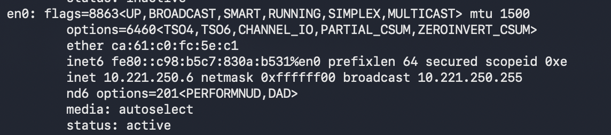
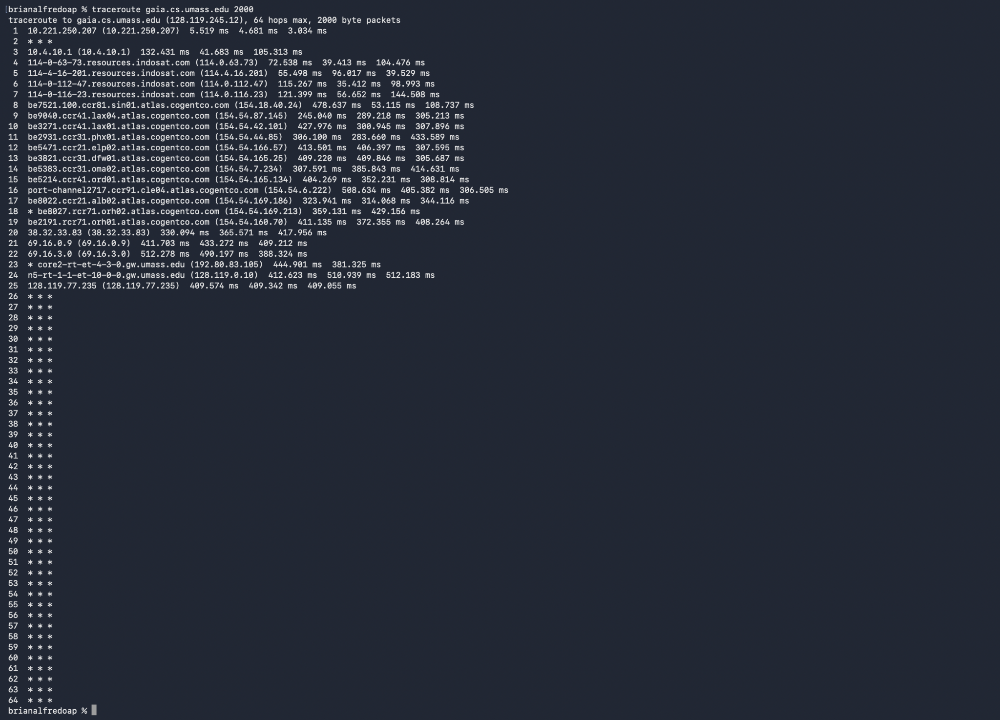
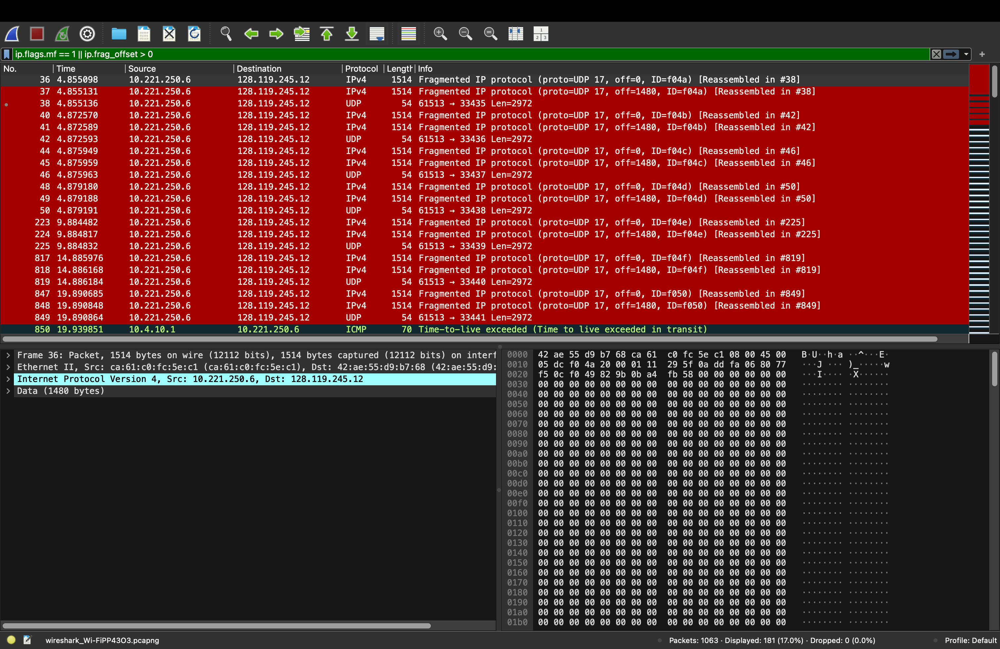
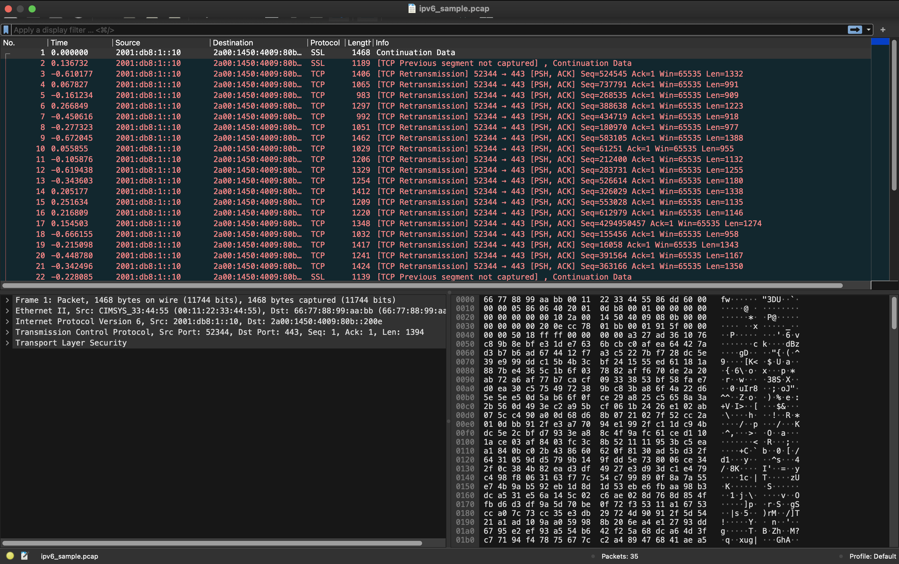
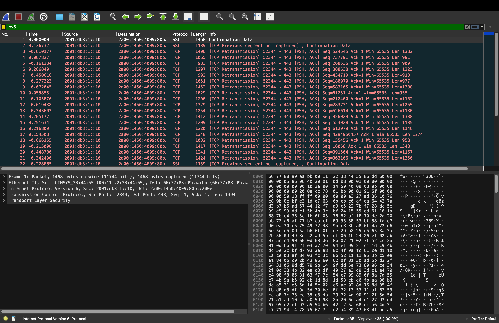

Nama    : Brian Alfredo Adhita Putra 
NIM     : 103072400165

# Modul 10 - IP

## Tujuan Praktikum
1. Mahasiswa dapat menginvestigasi cara kerja protokol IP menggunakan Wireshark

## 1. Apa itu IP address?
IP Address (Internet Protocol Address) adalah alamat unik yang dimiliki setiap perangkat dalam jaringan komputer agar perangkat tersebut dapat saling berkomunikasi. IP Address berfungsi sebagai identitas perangkat ketika mengirim maupun menerima data di jaringan internet ataupun jaringan lokal.
IP Address terbagi menjadi dua jenis yaitu:
- IPv4
Menggunakan 32-bit alamat.
Contoh: 192.168.100.133
- IPv6
Menggunakan 128-bit alamat.
Contoh: 2001:db8:1::10

Contoh IP pada laptop saya:

- IPv4 : 10.221.250.6
- IPv6 : fe80::c98:b5c7:830a:b531%en0

## 2. Traceroute dari suatu website
Traceroute adalah metode yang digunakan untuk mengetahui jalur atau hop yang dilewati paket data dari komputer menuju server tujuan.

Hasil traceroute :
 
Berdasarkan hasil traceroute, paket data dari laptop menuju gaia.cs.umass.edu melewati beberapa router lokal ISP Indosat dan backbone internasional Cogent sebelum mencapai server tujuan. Paket melewati jaringan lokal, ISP Indosat, hingga backbone internasional Cogent. Nilai waktu (ms) menunjukkan lama perjalanan paket pada setiap hop. Tanda * * * menandakan router tidak memberikan respon atau paket diblokir firewall. Traceroute bekerja menggunakan TTL (Time To Live), di mana setiap router mengurangi nilai TTL hingga akhirnya mengirim pesan ICMP Time Exceeded. Karena menggunakan ukuran paket 2000 byte, paket juga berpotensi mengalami fragmentasi karena melebihi MTU standar 1500 byte.

## 3. Apa itu ICMP, MTU, TTL
### ICMP (Internet Control Message Protocol)
ICMP adalah protokol yang digunakan untuk memberikan informasi mengenai kondisi jaringan, seperti error reporting dan pengecekan koneksi.
Contoh penggunaan ICMP:
- Ping
- Traceroute
- Pesan error jaringan

### MTU (Maximum Transmission Unit)
MTU adalah ukuran maksimum data yang dapat dikirim dalam satu frame jaringan tanpa mengalami fragmentasi. Pada jaringan Ethernet biasanya nilai MTU adalah 1500 byte. Jika ukuran paket lebih besar dari MTU, maka paket akan dipecah menjadi beberapa bagian yang disebut fragmentasi.

### TTL (Time To Live)
TTL adalah batas jumlah hop/router yang dapat dilewati paket data di jaringan. Setiap kali paket melewati router, nilai TTL akan berkurang sebesar 1. Jika nilai TTL mencapai 0, maka paket akan dibuang dan router akan mengirim pesan ICMP Time Exceeded. Fungsinya untuk mencegah paket terus berputar di jaringan apabila terjadi kesalahan routing.

## 4. Cari contoh Fragmentasi di wireshark yang kalian lakukan
Fragmentasi adalah proses pemecahan paket IP menjadi beberapa bagian yang lebih kecil karena ukuran paket melebihi nilai MTU jaringan.

Hasil Fragmentasi:
1. Buka Wireshark dan pilih jaringan yang aktif (WiFi/en0)
2. Klik start
3. Buka terminal masukkan ini "traceroute gaia.cs.umass.edu 3000"
4. Kembali ke wireshark stop capture, lalu filter "ip.flags.mf == 1 || ip.frag_offset >"
 
Berdasarkan hasil capture Wireshark ditemukan paket Fragmented IP protocol yang menunjukkan terjadinya fragmentasi pada paket UDP. Paket memiliki ukuran besar sehingga dipecah menjadi beberapa fragment dengan nilai Fragment Offset berbeda, yaitu off=0 dan off=1480. Selain itu ditemukan nilai Identification yang sama (ID=f04a) yang menandakan bahwa fragment berasal dari satu paket yang sama. Informasi Reassembled in menunjukkan bahwa fragment berhasil digabung kembali menjadi paket utuh.

## 5. Carilah IPv6 di wireshark yang kalian lakukan
IPv6 adalah versi terbaru dari Internet Protocol yang digunakan untuk komunikasi data di jaringan internet. IPv6 memiliki alamat 128-bit sehingga dapat menyediakan alamat IP lebih banyak dibandingkan IPv4.

### Analisis IPv6 di Wireshark
1. Buka file ipv6_sample.pcap dengan wireshark

2. Filter "ipv6"

Berdasarkan hasil capture di Wireshark, ditemukan paket yang menggunakan protokol IPv6. Hal ini terlihat dari detail paket yang menampilkan Internet Protocol Version 6 dengan alamat source 2001:db8:1::10 dan destination 2a00:1450:4009:80b::200e. Alamat tersebut menggunakan format heksadesimal dengan tanda titik dua (:) yang merupakan IPv6. Paket menggunakan protokol TCP dan dikirim ke port 443 yang menunjukkan komunikasi HTTPS atau akses web. Selain itu terdapat beberapa TCP Retransmission yang menandakan adanya pengiriman ulang paket saat komunikasi berlangsung.

## Terima Kasih