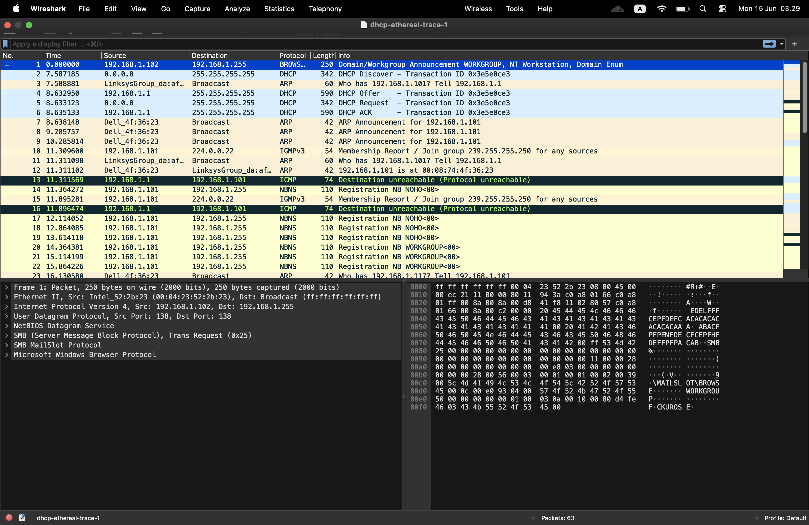
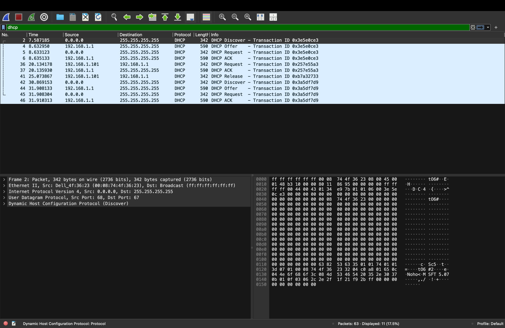

Nama    : Brian Alfredo Adhita Putra 
NIM     : 103072400165

# Modul 11 - DHCP

## Tujuan Praktikum
1. Mahasiswa dapat menginvestigasi cara kerja protokol DHCP menggunakan Wireshark.

## Apa itu DHCP?
DHCP (Dynamic Host Configuration Protocol) adalah protokol jaringan yang digunakan untuk memberikan alamat IP dan konfigurasi jaringan lainnya secara otomatis kepada perangkat yang terhubung ke jaringan. Dengan adanya DHCP, pengguna tidak perlu mengatur IP address, subnet mask, gateway, atau DNS secara manual karena semua informasi tersebut diberikan langsung oleh server DHCP. Protokol ini sangat membantu dalam pengelolaan jaringan, terutama pada jaringan yang memiliki banyak perangkat, karena membuat proses konfigurasi menjadi lebih cepat, mudah, dan mengurangi risiko terjadinya kesalahan atau konflik alamat IP.

## Kelebihan DHCP
1. Tidak perlu mengatur alamat IP secara manual karena semuanya diberikan secara otomatis oleh server DHCP.
2. Proses konfigurasi jaringan jadi lebih cepat dan praktis, terutama jika perangkat yang terhubung jumlahnya banyak.
3. Mengurangi kemungkinan terjadinya kesalahan saat memasukkan konfigurasi IP.
4. Membantu mencegah konflik IP karena pembagian alamat dilakukan secara terpusat.
5. Memudahkan administrator jaringan dalam mengelola dan mengubah konfigurasi jaringan.

## Kekurangan DHCP
1. Jika server DHCP mengalami gangguan atau mati, perangkat baru tidak bisa mendapatkan alamat IP.
2. Jaringan menjadi bergantung pada server DHCP untuk proses pemberian alamat IP.
3. Ada risiko keamanan jika terdapat DHCP Server palsu yang memberikan konfigurasi jaringan yang salah.
4. Kurang cocok digunakan untuk perangkat yang membutuhkan alamat IP tetap, seperti server atau printer jaringan.
5. Jika terjadi kesalahan konfigurasi pada server DHCP, banyak perangkat dalam jaringan bisa ikut terdampak.

## Langkah-Langkah
1. Mengunduh file http://gaia.cs.umass.edu/wireshark-labs/wireshark-traces.zip.
2. Mengekstrak file yang telah diunduh.
3. Membuka file capture DHCP menggunakan aplikasi Wireshark.

4. Menuliskan filter dhcp pada kolom filter untuk menampilkan paket DHCP saja.

5. Mengamati proses komunikasi antara client dan server DHCP.

## Hasil Pengamatan
Setelah filter DHCP diterapkan, terlihat empat paket utama yang menunjukkan proses komunikasi antara client dan server DHCP, yaitu:
1. DHCP Discover
Client mengirimkan pesan DHCP Discover ke jaringan untuk mencari server DHCP yang tersedia. Paket dikirim secara broadcast karena client belum memiliki alamat IP.
2. DHCP Offer
Server DHCP merespons dengan mengirimkan DHCP Offer yang berisi penawaran alamat IP serta informasi konfigurasi jaringan lainnya.
3. DHCP Request
Client mengirimkan DHCP Request sebagai bentuk persetujuan terhadap alamat IP yang ditawarkan oleh server DHCP.
4. DHCP ACK
Server mengirimkan DHCP Acknowledgement (ACK) untuk mengonfirmasi bahwa alamat IP telah diberikan dan dapat digunakan oleh client.

## Kesimpulan
Berdasarkan praktikum yang telah dilakukan, dapat disimpulkan bahwa DHCP berfungsi untuk memberikan alamat IP dan konfigurasi jaringan secara otomatis kepada client. Melalui Wireshark, proses komunikasi DHCP dapat diamati dengan jelas melalui empat tahapan utama yaitu Discover, Offer, Request, dan Acknowledgement (DORA). Penggunaan DHCP membuat pengelolaan jaringan menjadi lebih mudah, cepat, dan mengurangi kemungkinan terjadinya kesalahan konfigurasi alamat IP.

## Terima Kasih