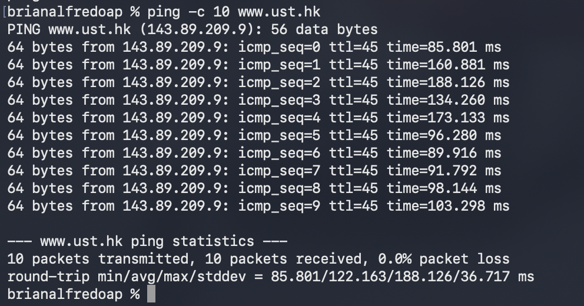
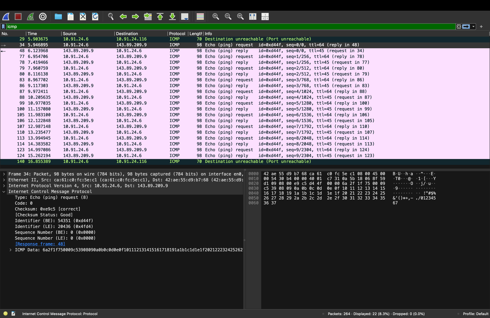
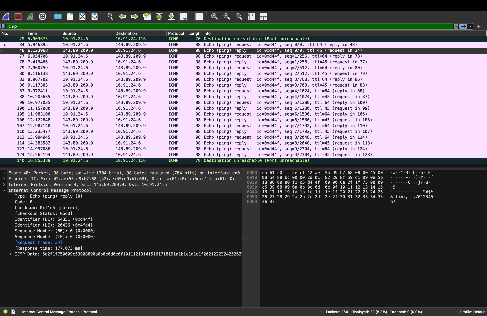
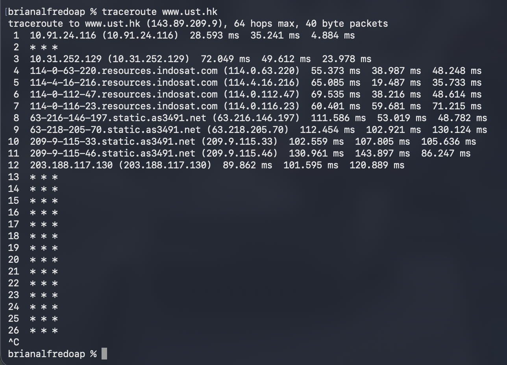
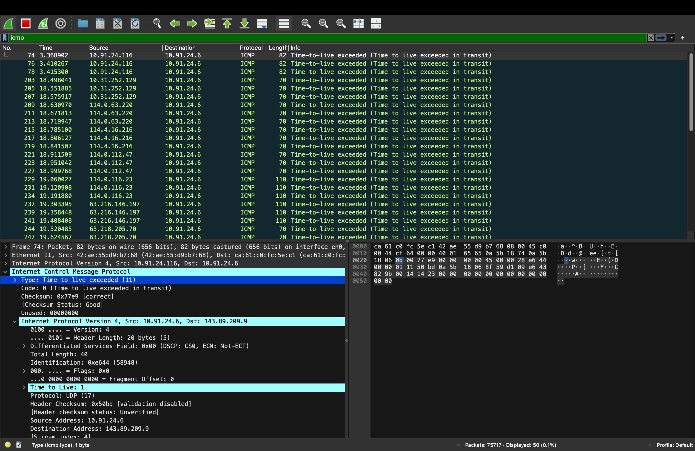

Nama    : Brian Alfredo Adhita Putra 
NIM     : 103072400165

# Modul 12 - ICMP

## Tujuan Praktikum
1. Mahasiswa dapat menginvestigasi cara kerja protokol ICMP menggunakan Wireshark
2. Mahasiswa dapat membuat program ICMP Pinger
3. Melakukan asistensi dan laporan progress pengerjaan tugas besar

## Apa itu ICMP?
ICMP (Internet Control Message Protocol) adalah protokol yang digunakan untuk mengirimkan pesan kontrol dan informasi terkait kondisi jaringan. ICMP membantu perangkat jaringan dalam memberikan informasi apakah suatu tujuan dapat diakses atau terjadi kesalahan selama proses pengiriman data.

## Fungsi ICMP
- Membantu mengecek koneksi jaringan.
- Mengetahui apakah host tujuan masih aktif atau tidak.
- Menampilkan jalur yang dilewati paket saat menuju tujuan.
- Memberikan informasi jika terjadi masalah dalam pengiriman paket.

## Hubungan ICMP dengan IP
ICMP bekerja bersama protokol IP. Saat paket IP mengalami masalah atau membutuhkan informasi tertentu, ICMP akan mengirimkan pesan kontrol kepada pengirim. Dengan demikian, ICMP berfungsi sebagai pendukung protokol IP dalam menjaga komunikasi jaringan tetap berjalan dengan baik.

## Beberapa bagian penting yang terdapat pada paket ICMP antara lain:
- Type : Menunjukkan jenis pesan ICMP.
- Code : Memberikan informasi tambahan mengenai jenis pesan.
- Checksum : Digunakan untuk memeriksa integritas data.
- Identifier : Penanda paket agar dapat dikenali.
- Sequence Number : Menunjukkan nomor urut paket yang dikirim.

## Percobaan 1 : Analisis ICMP Menggunakan Ping
1. Menjalankan Wireshark dan memilih interface jaringan yang aktif.
2. Memulai proses capture paket.
3. Membuka Terminal dan menjalankan perintah:
4. ping -c 10 www.ust.hk

5. Menghentikan proses capture setelah ping selesai.
6. Melakukan filter dengan kata kunci icmp.
7. Mengamati paket ICMP Echo Request dan ICMP Echo Reply.
Saat perintah ping dijalankan sebanyak 10 kali, komputer akan mengirimkan paket Echo Request ke server tujuan. Jika server merespons, maka akan dikirim kembali paket Echo Reply. Karena terdapat 10 kali pengiriman ping, maka akan muncul total 20 paket ICMP yang terdiri dari 10 Echo Request dan 10 Echo Reply.

### ICMP Echo Request

- Type = 8 menunjukkan paket merupakan permintaan ping.
- Code = 0 menandakan tidak ada informasi tambahan.
- Checksum bernilai valid sehingga paket terkirim dengan baik.
- Identifier digunakan untuk mengenali pasangan request dan reply.
- Sequence Number menunjukkan urutan paket yang dikirim.

### ICMP Echo Reply

- Type = 0 menunjukkan paket merupakan balasan ping.
- Code = 0 menandakan tidak ada pesan kesalahan.
- Checksum valid sehingga data diterima dengan benar.
- Identifier sama dengan paket request.
- Sequence Number juga sama dengan request yang dibalas.

### Hasil Percobaan
Berdasarkan hasil pengamatan pada Wireshark, paket Echo Request dan Echo Reply berhasil ditampilkan dengan lengkap. Hal ini menunjukkan bahwa komunikasi antara host dan server tujuan berjalan dengan baik tanpa adanya gangguan pada jaringan.

## Percobaan 2 : Analisis ICMP Menggunakan Traceroute
1. Menjalankan Wireshark dan memulai capture paket.
2. Membuka Command Prompt lalu menjalankan perintah:
3. traceroute www.ust.hk

4. Menghentikan capture setelah proses selesai.
5. Melakukan filter ICMP pada Wireshark.
6. Mengamati paket Echo Request dan Time Exceeded.
Traceroute digunakan untuk mengetahui jalur yang dilewati paket menuju tujuan. Teknik yang digunakan adalah mengirim paket dengan nilai TTL yang terus bertambah. Ketika nilai TTL habis di suatu router, router tersebut akan mengirimkan pesan ICMP Time Exceeded kepada pengirim.

### ICMP Echo Request
- Type = 8 menunjukkan paket permintaan.
- Code = 0 berarti tidak ada informasi tambahan.
- Checksum valid sehingga paket terkirim dengan baik.
- Identifier digunakan sebagai penanda paket.
- Sequence Number menunjukkan urutan paket yang dikirim.

### ICMP Time Exceeded

- Type = 11 menunjukkan paket Time Exceeded.
- Code = 0 menandakan TTL habis selama perjalanan.
- Checksum valid dan tidak ditemukan error.
- Source IP menunjukkan alamat router yang mengirim pesan tersebut.
- Destination IP menunjukkan alamat perangkat yang menjalankan traceroute.

### Hasil Percobaan
Dari hasil capture terlihat beberapa paket Time Exceeded yang berasal dari router-router yang dilewati paket. Informasi tersebut dapat digunakan untuk mengetahui jalur perjalanan paket dari host menuju server tujuan.

## Kesimpulan
Pada praktikum ini dipelajari cara kerja protokol ICMP dalam jaringan komputer. Melalui percobaan ping dapat diketahui bahwa ICMP menggunakan pesan Echo Request dan Echo Reply untuk mengecek konektivitas jaringan. Sedangkan pada traceroute, ICMP menggunakan pesan Time Exceeded untuk menunjukkan jalur yang dilewati paket. Dari hasil pengamatan di Wireshark, seluruh proses komunikasi ICMP dapat dianalisis dengan jelas sehingga memudahkan pemahaman tentang proses pengiriman paket pada jaringan.

## Terima Kasih