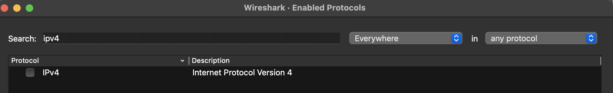
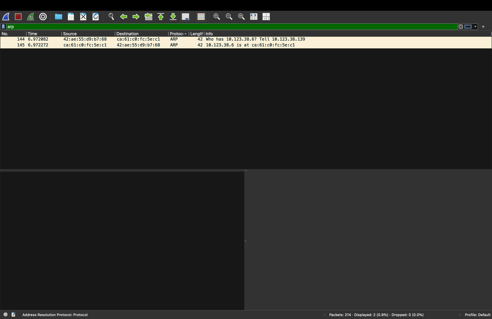
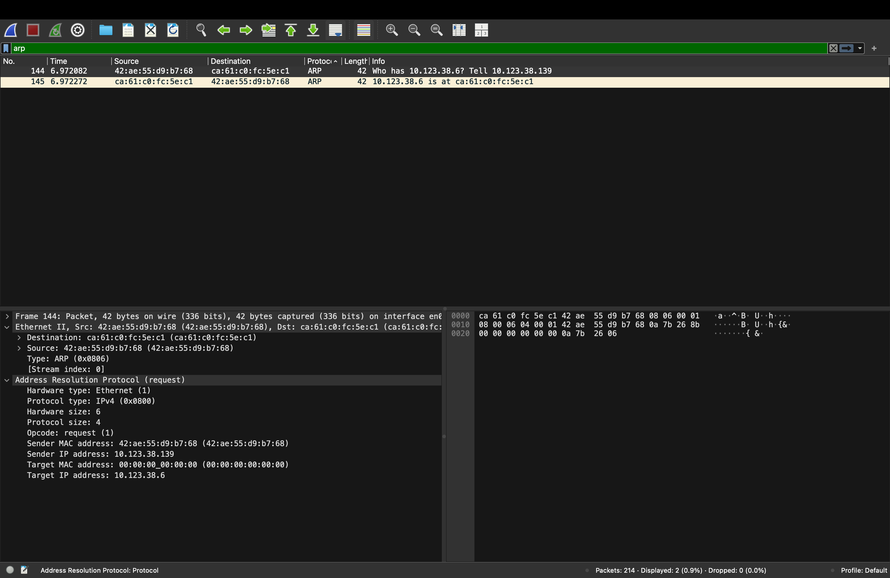

Nama    : Brian Alfredo Adhita Putra 
NIM     : 103072400165

# Modul 13 - Ethernet and ARP

## Tujuan Praktikum
1. Mahasiswa dapat menginvestigasi cara kerja Ethernet dan ARP menggunakan Wireshark

# MODUL 13 ETHERNET DAN ARP

## Ethernet

Ethernet merupakan teknologi jaringan yang digunakan untuk menghubungkan perangkat dalam jaringan lokal (LAN). Ethernet bekerja pada Data Link Layer dan menggunakan MAC Address sebagai identitas unik setiap perangkat. Saat data dikirim melalui jaringan, Ethernet akan membungkus data tersebut ke dalam frame agar dapat diteruskan ke tujuan yang benar.

## Konsep Ethernet

Ethernet berfungsi sebagai media komunikasi antar perangkat dalam jaringan lokal. Setiap frame Ethernet memiliki informasi seperti Source MAC Address, Destination MAC Address, dan Type Field yang menunjukkan jenis protokol yang dibawa.

## ARP

ARP (Address Resolution Protocol) adalah protokol yang digunakan untuk menerjemahkan alamat IP menjadi alamat MAC Address pada jaringan lokal. ARP diperlukan karena proses komunikasi pada Ethernet menggunakan MAC Address, sedangkan pengguna biasanya mengenali perangkat berdasarkan alamat IP.

## Konsep ARP

ARP bekerja di antara Data Link Layer dan Network Layer. Saat sebuah perangkat ingin mengirim data ke IP tertentu, perangkat tersebut harus mengetahui MAC Address tujuan terlebih dahulu. Jika belum diketahui, ARP akan melakukan proses pencarian melalui ARP Request dan ARP Reply.

### Cara Kerja ARP

1. Perangkat ingin mengirim data ke alamat IP tertentu.
2. Sistem memeriksa ARP Cache.
3. Jika data tidak ditemukan, perangkat mengirim ARP Request secara broadcast.
4. Perangkat tujuan mengirim ARP Reply yang berisi MAC Address.
5. Informasi disimpan ke ARP Cache.
6. Data dapat dikirim ke perangkat tujuan.

## Langkah-Langkah

1. Membuka Terminal sebagai Administrator.

2. Menjalankan perintah "sudo arp -a -d" untuk menghapus seluruh isi ARP Cache.

3. Jalankan aplikasi Wireshark. Pastikan protokol IPv4 telah nonaktif melalui menu Analyze → Enabled Protocols → IPv4.

4. Memulai proses capture paket.

5. Membuka browser dan mengakses: http://gaia.cs.umass.edu/wireshark-labs/HTTP-wireshark-lab-file3.html

6. Menunggu hingga halaman berhasil dimuat.
7. Menghentikan proses capture pada Wireshark.

8. Filter arp.

9. Pilih salah satu paket.

10. Mengamati frame Ethernet dan paket ARP yang berhasil ditangkap.

## Analisis Ethernet

Berdasarkan hasil capture Wireshark, terlihat bahwa paket ARP dikirim menggunakan frame Ethernet. Frame tersebut memiliki Source MAC Address 42:ae:55:d9:b7:68 dan Destination MAC Address ca:61:c0:fc:5e:c1 dengan tipe protokol ARP (0x0806). Dari hasil ini dapat dilihat bahwa Ethernet berperan sebagai media yang mengirimkan data antar perangkat dalam jaringan lokal menggunakan MAC Address sebagai alamat fisiknya.

## Analisis ARP

Dari hasil capture Wireshark, terlihat sebuah paket ARP Request yang dikirim oleh perangkat dengan IP 10.123.38.139 untuk mencari MAC Address dari IP 10.123.38.6. Karena alamat MAC tujuan belum diketahui, bagian Target MAC Address masih bernilai 00:00:00:00:00:00. Setelah itu, perangkat dengan IP 10.123.38.6 mengirimkan ARP Reply yang berisi MAC Address ca:61:c0:fc:5e:c1. Dari proses ini dapat dipahami bahwa ARP membantu perangkat menemukan MAC Address berdasarkan IP Address sehingga komunikasi dalam jaringan lokal bisa berjalan dengan lancar.

## Kesimpulan

Berdasarkan hasil yang telah dilakukan, Ethernet digunakan sebagai teknologi pengiriman data pada jaringan lokal dengan memanfaatkan MAC Address sebagai alamat perangkat. Sementara itu, ARP berfungsi untuk mencari dan mencocokkan alamat MAC berdasarkan alamat IP yang diketahui. Kedua protokol tersebut saling mendukung sehingga komunikasi data dalam jaringan lokal dapat berlangsung dengan baik.

## Terima Kasih