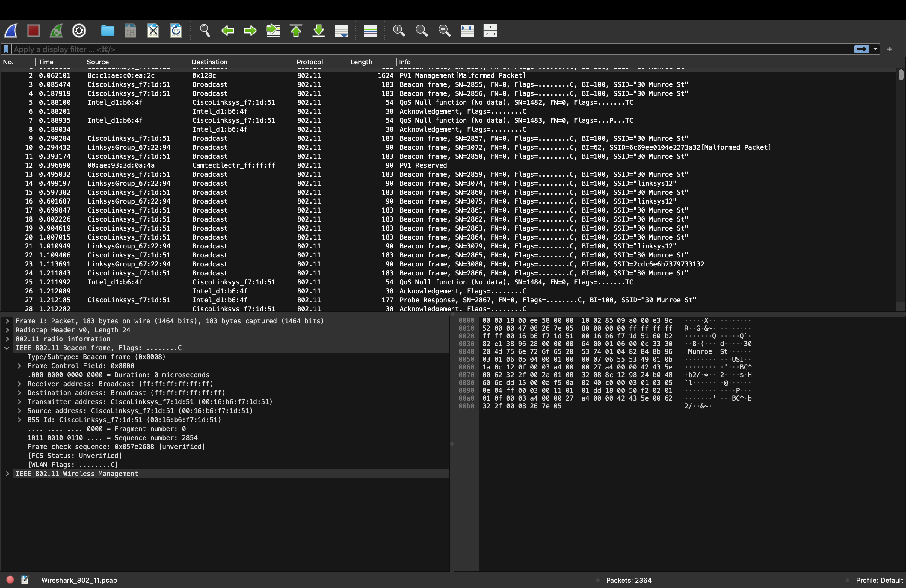
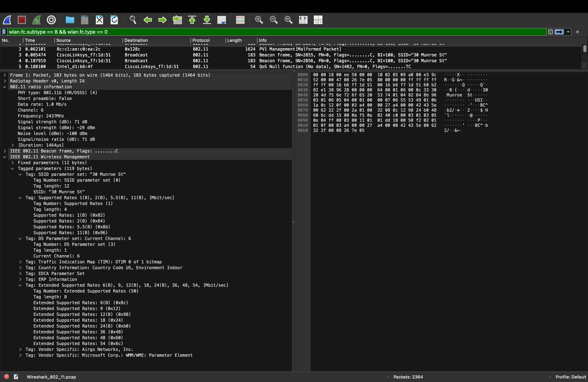
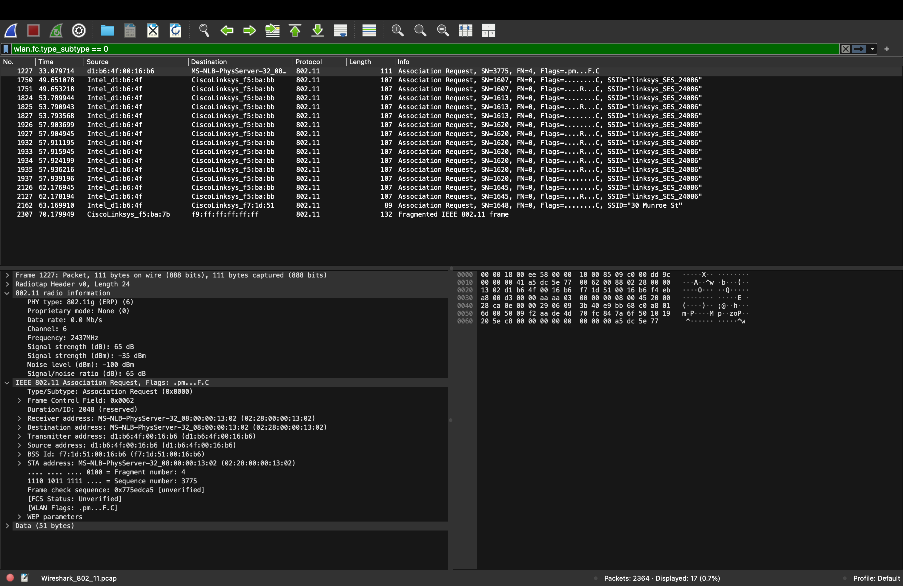
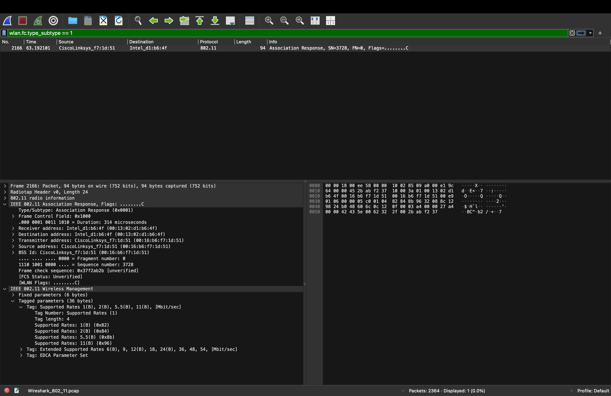

Nama    : Brian Alfredo Adhita Putra 
NIM     : 103072400165

# Modul 14 - 802.11 WiFi

## Tujuan Praktikum
1. Mahasiswa dapat menginvestigasi cara kerja WiFi menggunakan Wireshark

## Apa itu WiFi (IEEE 802.11)?

IEEE 802.11 merupakan standar jaringan nirkabel (Wireless LAN) yang digunakan sebagai dasar teknologi WiFi. Standar ini mengatur bagaimana perangkat dapat berkomunikasi melalui gelombang radio tanpa menggunakan kabel. IEEE 802.11 bekerja pada lapisan Physical Layer dan MAC Layer untuk mengatur proses pengiriman dan penerimaan data antar perangkat dalam jaringan nirkabel.

## Perbandingan Frekuensi WiFi

### Frekuensi 2.4 GHz

**Kelebihan**

1. Jangkauan sinyal lebih luas.
2. Mampu menembus dinding atau penghalang dengan lebih baik.
3. Cocok digunakan pada area yang cukup besar.

**Kekurangan**

1. Kecepatan transfer data lebih rendah.
2. Lebih mudah mengalami gangguan karena banyak perangkat lain menggunakan frekuensi yang sama.

### Frekuensi 5 GHz

**Kelebihan**

1. Kecepatan transfer data lebih tinggi.
2. Interferensi lebih sedikit.
3. Cocok untuk aktivitas yang membutuhkan koneksi cepat seperti streaming dan gaming.

**Kekurangan**

1. Jangkauan sinyal lebih pendek.
2. Kurang baik dalam menembus dinding atau penghalang fisik.

## Langkah-Langkah

1. Mengunduh file http://gaia.cs.umass.edu/wireshark-labs/wireshark-traces.zip dari situs laboratorium Wireshark.

2. Mengekstrak file hasil unduhan.

3. Membuka file Wireshark_802_11.pcap menggunakan aplikasi Wireshark.

4. Mengamati Beacon Frame menggunakan filter: wlan.fc.subtype == 8 && wlan.fc.type == 0

5. Mengamati parameter SSID, channel, signal strength, dan supported rates.

6. Menganalisis proses transfer data menggunakan filter alamat IP server.

7. Mengamati proses Association dan Disassociation menggunakan filter: wlan.fc.type_subtype == 0

8. Mengamati paket Association Response menggunakan filter: wlan.fc.type_subtype == 1

## Analisis Beacon Frame

Berdasarkan hasil capture Wireshark, terlihat bahwa Access Point secara berkala mengirimkan Beacon Frame untuk mengumumkan keberadaan jaringan WiFi kepada perangkat di sekitarnya. Jaringan yang terdeteksi memiliki SSID "30 Munroe St", menggunakan Channel 6 pada frekuensi 2437 MHz (2.4 GHz), dengan kekuatan sinyal sekitar -29 dBm yang menunjukkan kualitas sinyal sangat baik.

## Analisis Tagged Parameters

Pada Tagged Parameters terlihat informasi penting mengenai jaringan, seperti SSID "30 Munroe St", kecepatan yang didukung mulai dari 1 Mbps hingga 54 Mbps, serta penggunaan Channel 6. Informasi ini digunakan oleh perangkat klien untuk mengenali dan menyesuaikan koneksi dengan Access Point.

## Analisis Data Transfer

Dari hasil capture terlihat proses komunikasi antara klien 192.168.1.109 dan server 128.119.245.12 yang diawali dengan proses TCP Three-Way Handshake (SYN, SYN-ACK, ACK). Setelah koneksi berhasil dibuat, klien mengirim paket HTTP GET untuk meminta file dari server, yang menunjukkan bahwa pertukaran data melalui jaringan WiFi berjalan dengan baik.

## Analisis Association dan Disassociation

Hasil capture menunjukkan bahwa perangkat klien awalnya mencoba terhubung ke jaringan "linksys_SES_24086", kemudian berpindah dan mengirim Association Request ke jaringan "30 Munroe St". Selanjutnya Access Point mengirim Association Response sebagai tanda bahwa permintaan koneksi diterima dan klien berhasil terhubung ke jaringan WiFi tersebut.

## Kesimpulan

Berdasarkan hasil yang telah dilakukan, dapat disimpulkan bahwa jaringan WiFi menggunakan standar IEEE 802.11 untuk mengatur komunikasi data secara nirkabel. Melalui Wireshark dapat diamati proses Beacon Frame, transfer data, serta Association dan Disassociation antara klien dan Access Point. Selain itu, praktikum ini menunjukkan bagaimana perangkat menemukan jaringan WiFi, melakukan proses koneksi, dan bertukar data melalui jaringan nirkabel.

## Terima Kasih