Nama    : Brian Alfredo Adhita Putra 
NIM     : 103072400165

# Modul 3 - HTTP

## Tujuan Praktikum
Mahasiswa dapat menginvestigasi cara kerja protokol HTTP menggunakan Wireshark.

## Basic HTTP GET
1. Jalankan aplikasi wireshark.
2. Pilih interface wifi dan mulai proses capture.
3. Setelah itu buka browser dan masukkan url ini: (http://gaia.cs.umass.edu/wireshark-labs/HTTP-wireshark-file1.html)
4. Hasilnya akan seperti ini.
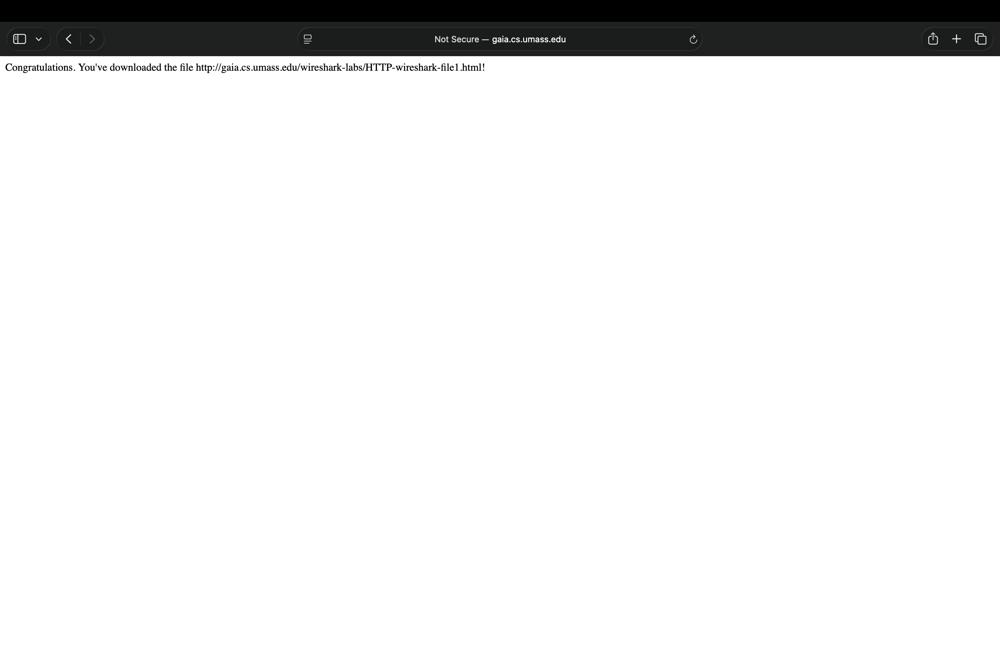
Diatas terlihat kalau browser mengirimkan HTTP Get request ke server gaia.cs.umass.edu. jadi ini bertujuan untuk meminta file HTTP-wireshark-file1.html agar bisa ditampilkan di browser.
5. Masuk kembali ke wireshark dan lakukan filter "http".
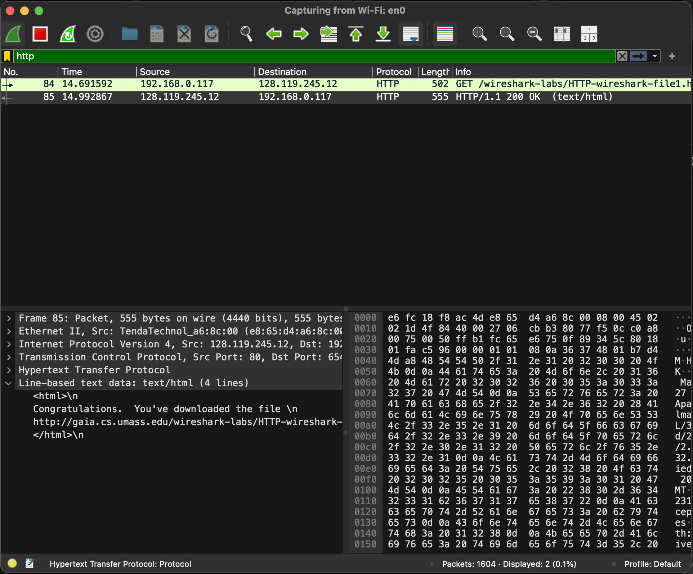
Setelah server menerima request dari browser, server kemudian mengirimkan response HTTP dengan status 200 OK. Status ini menandakan bahwa permintaan berhasil dan file HTML berhasil dikirim ke browser.

## HTTP Conditional GET
1. Buka kembali ke browser lalu masukkan url ini: (http://gaia.cs.umass.edu/wireshark-labs/HTTP-wireshark-file2.html)
2. Setelah halaman terbuka, halaman tersebut di-refresh kembali untuk melihat bagaimana conditional GET bekerja.
3. Pada percobaan kedua akan seperti ini.
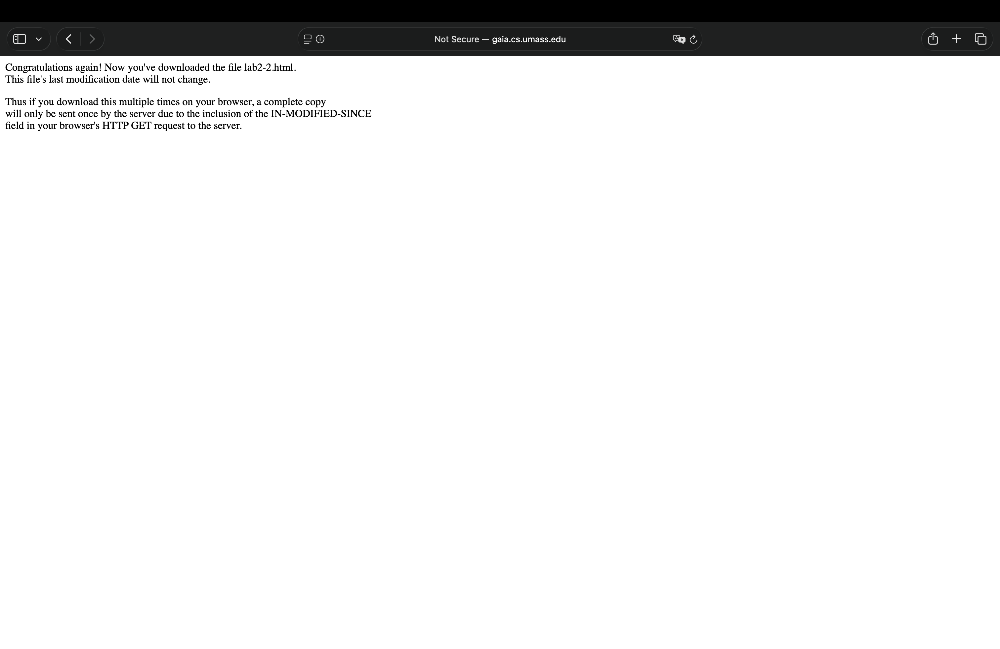
4. Masuk kembali ke wireshark dan lakukan filter "http".
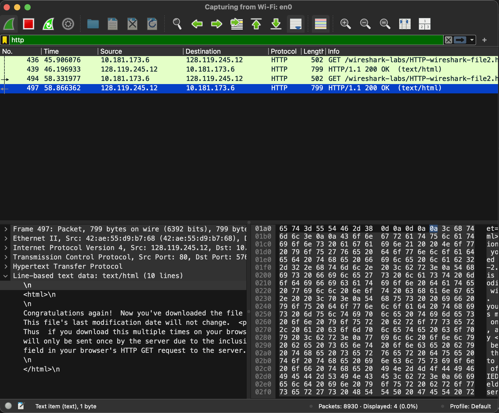
Pada request pertama server merespon dengan HTTP/1.1 200 OK. Setelah halaman direfresh, browser kembali meminta file yang sama dan karena tidak ada header If-Modified-Since, ini terjadi karena tidak semua browser secara otomatis mengirimkan conditional GET saat halaman direfresh. Jadi server kembali merespon dengan HTTP/1.1 200 OK dan mengirim ulang file HTML tersebut.

## Retrieving Long Documents
1. Hapus cache browser terlebih dahulu.
2. Masuk kembali ke wireshark dan mulai proses capture.
3. Buka kembali ke browser lalu masukkan url ini: (http://gaia.cs.umass.edu/wireshark-labs/HTTP-wireshark-file3.html)
4. Setelah halaman terbuka, akan menampilkan seperti ini.
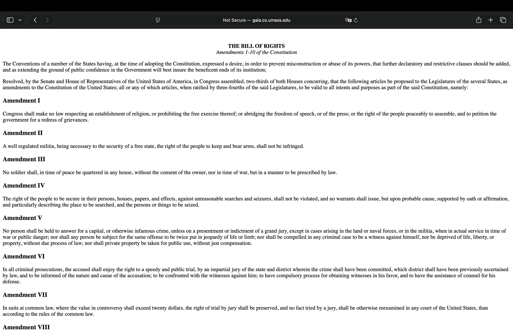
5. Masuk kembali ke wireshark lalu akan muncul seperti ini.
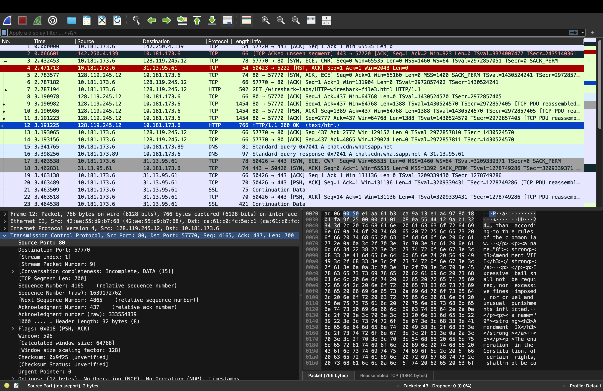
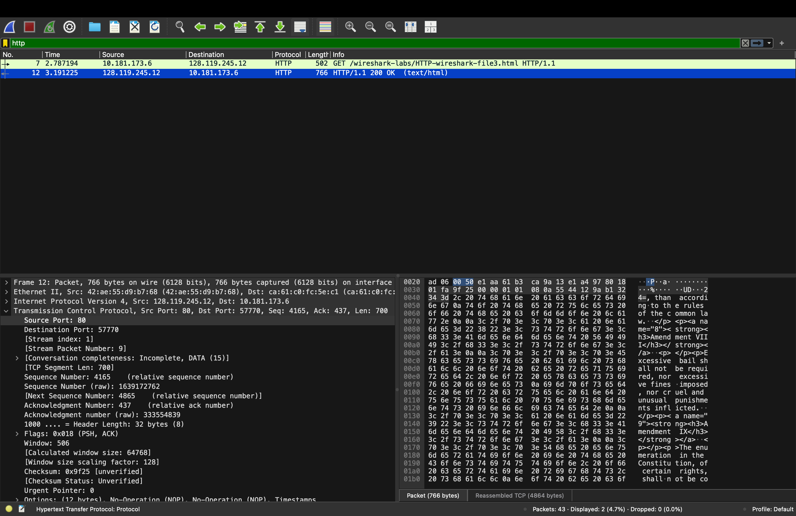
File HTML memiliki ukuran sekitar 4500 byte, sehingga tidak dapat dikirim dalam satu paket TCP. Jadi server mengirimkan data dalam beberapa segmen TCP.

## HTML Documents dengan Embedded Objects
1. Hapus cache browser terlebih dahulu.
2. Masuk kembali ke wireshark dan mulai proses capture.
3. Buka kembali ke browser sekarang menggunakan url ini: (http://gaia.cs.umass.edu/wireshark-labs/HTTP-wireshark-file4.html)
4. Setelah halaman terbuka, akan menampilkan seperti ini.
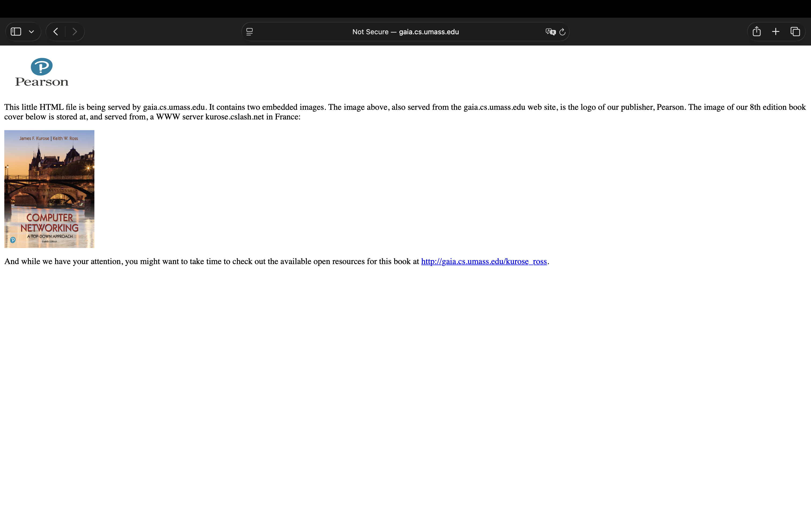
Pertama browser mengambil file HTML utama dari server.
5. Masuk kembali ke wireshark.
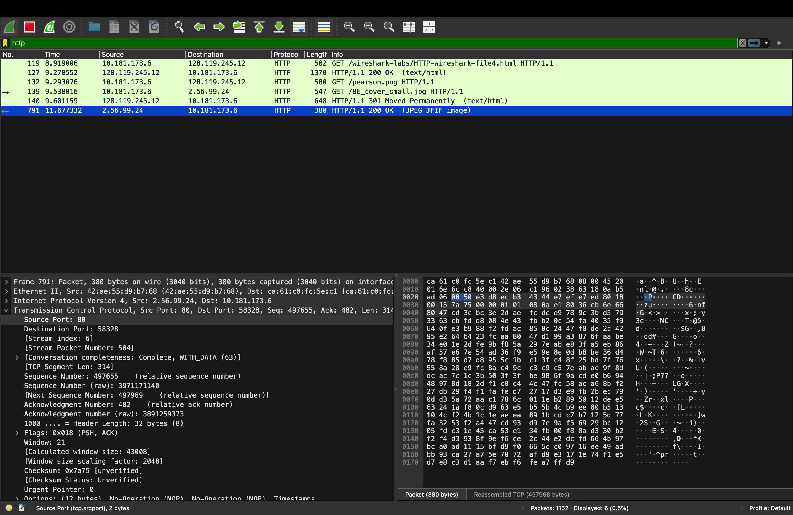
Setelah HTML dimuat, browser menemukan dua gambar yang ada di dalam halaman tersebut. Browser kemudian mengirim HTTP GET untuk mengambil gambar pearson.png dan 8E_cover_small.jpg, sehingga gambar dapat ditampilkan di halaman web.

## HTTP Authentication
1. Hapus cache browser terlebih dahulu.
2. Masuk kembali ke wireshark dan mulai proses capture.
3. Buka kembali ke browser sekarang menggunakan url ini: ()
Setelah halaman terbuka, akan menampilkan seperti ini.
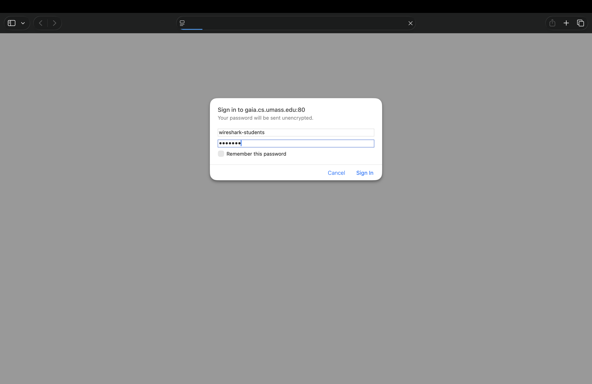
Login menggunakan username "wireshark-students" dan password "network", tampilannya akan seperti ini.
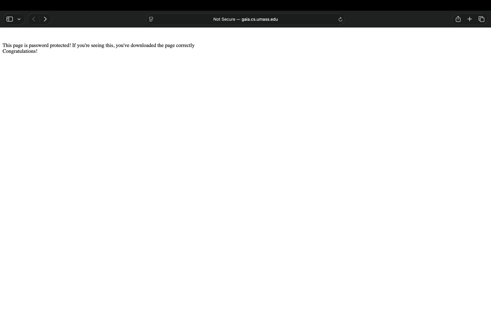
4. Masuk ke wireshark lalu filter "http"
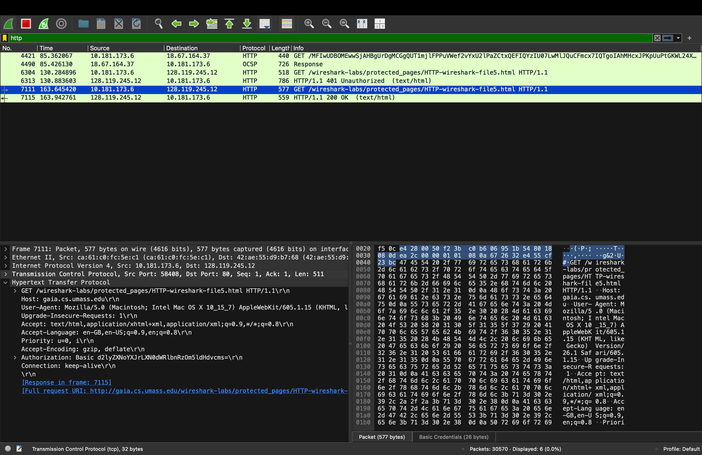
Pada paket HTTP terlihat header Authorization: Basic yang berisi informasi login dalam bentuk Base64 encoding. String tersebut jika di-decode menjadi wireshark-students:network, yaitu username dan password yang digunakan.

## Terima Kasih 