Nama    : Brian Alfredo Adhita Putra 
NIM     : 103072400165

# Modul 4 - DNS

## Tujuan Praktikum
Mahasiswa dapat menginvestigasi cara kerja DNS menggunakan Wireshark

## Nslookup
Nslookup merupakan salah satu tools yang digunakan untuk mengetahui informasi terkait DNS. Dengan menggunakan perintah ini, kita bisa melihat alamat IP dari suatu domain, mengetahui server DNS yang digunakan, serta informasi lainnya seperti mail server.

Cara Penggunaan Nslookup:

a. Buka terminal.

b. Jalankan perintah "nslookup www.mit.edu"
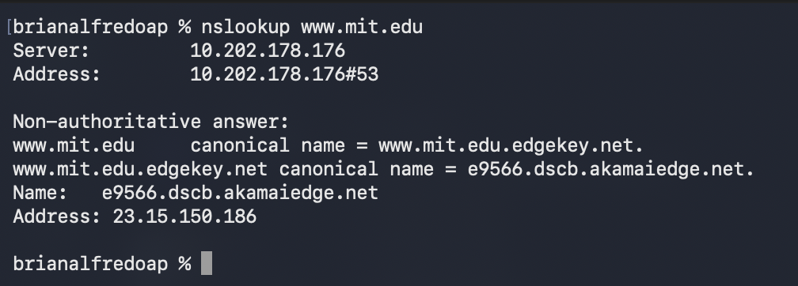
Perintah ini digunakan untuk mengetahui alamat IP dari domain www.mit.edu dan DNS server yang digunakan.

c. Jalankan perintah "nslookup -type=NS mit.edu"
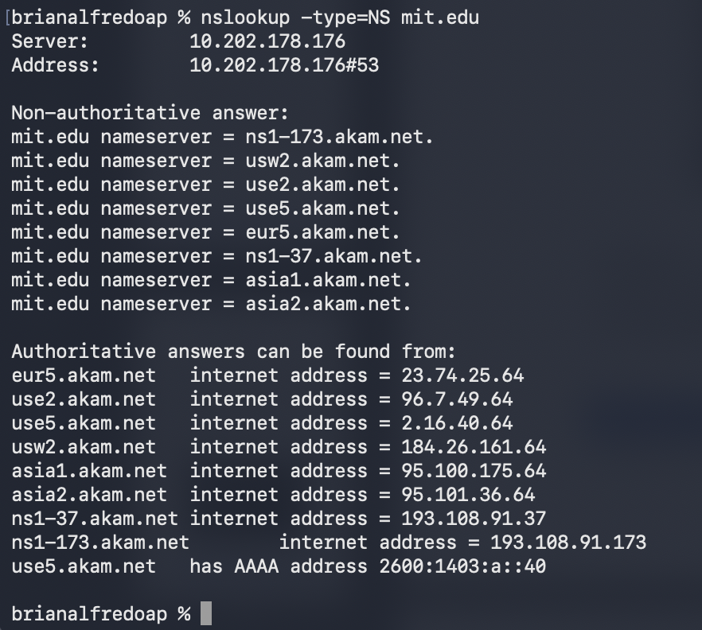

Perintah ini digunakan untuk melihat daftar DNS server yang bertanggung jawab terhadap domain mit.edu.

d. Jalankan perintah "nslookup www.aiit.or.kr bitsy.mit.edu" (menggunakan DNS publik karena server bitsy.mit.edu tidak merespon)
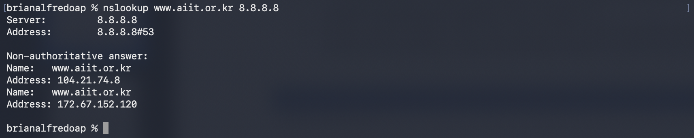
Perintah ini digunakan untuk melakukan query ke server DNS tertentu, bukan menggunakan DNS default.

Pengujian Mandiri:

a. Jalankan nslookup untuk mendapatkan alamat IP dari server web di Asia. Berapa alamat IP server tersebut?
Jalankan perintah "nslookup www.nus.edu.sg"
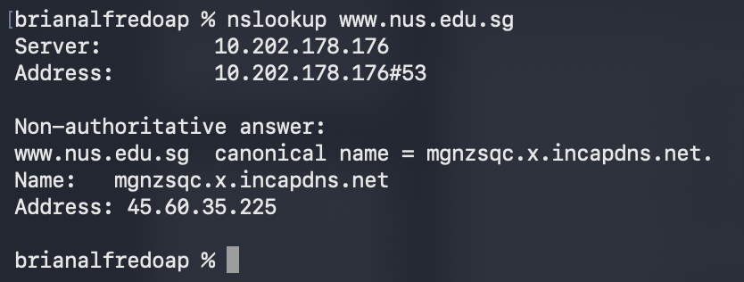

b. Jalankan nslookup agar dapat mengetahui server DNS otoritatif untuk universitas di Eropa.
Jalankan perintah "nslookup -type=NS ox.ac.uk"
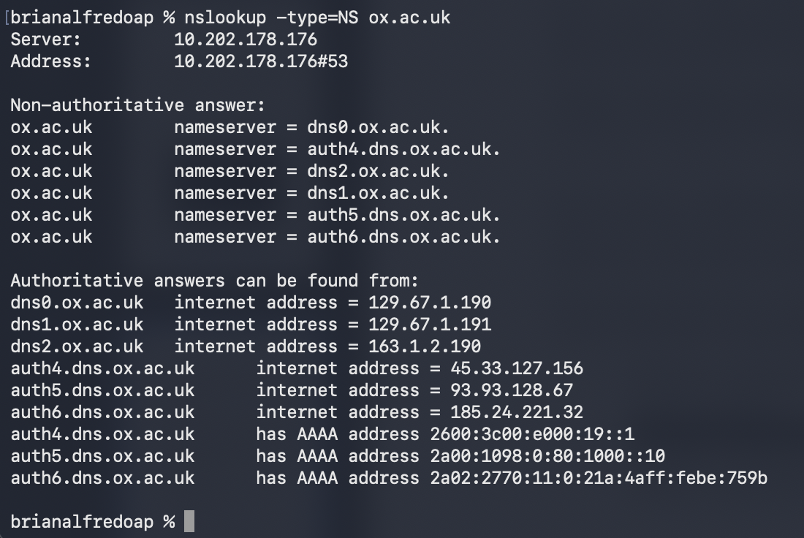

c. Jalankan nslookup untuk mencari tahu informasi mengenai server email dari Yahoo! Mail melalui salah satu server yang didapatkan di pertanyaan nomor 2. Apa alamat IP-nya?
Jalankan perintah "nslookup -type=MX yahoo.com dns0.ox.ac.uk"
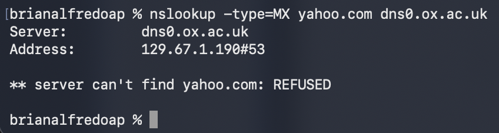

server DNS yang digunakan hanya melayani domain tertentu, sehingga permintaan terhadap domain lain bisa ditolak.

## Ifconfig
ifconfig adalah salah satu fasilitas kecil yang paling berguna di dalam host, terutama untuk men-debug masalah jaringan.

Cara penggunaan Ifconfig:

a. Untuk melihat alamat IP, jalankan perintah berikut "Ifconfig"
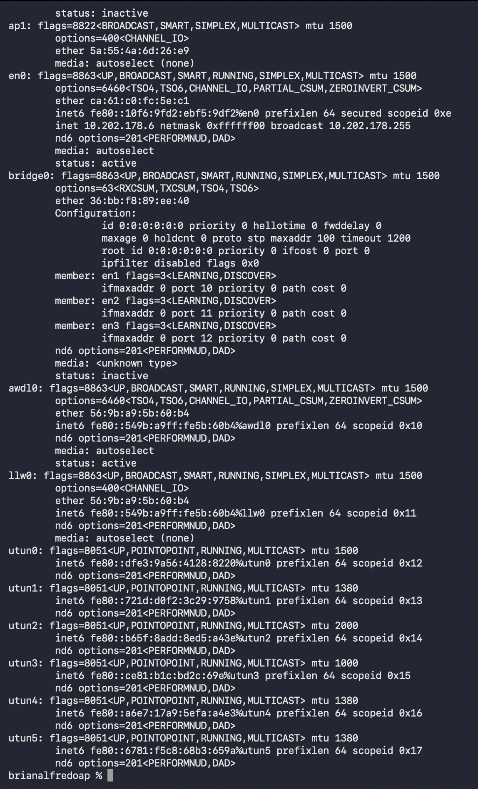

b. Untuk melihat record yang telah disimpan DNS Servern jalankan perintah berikut "scutil --dns"
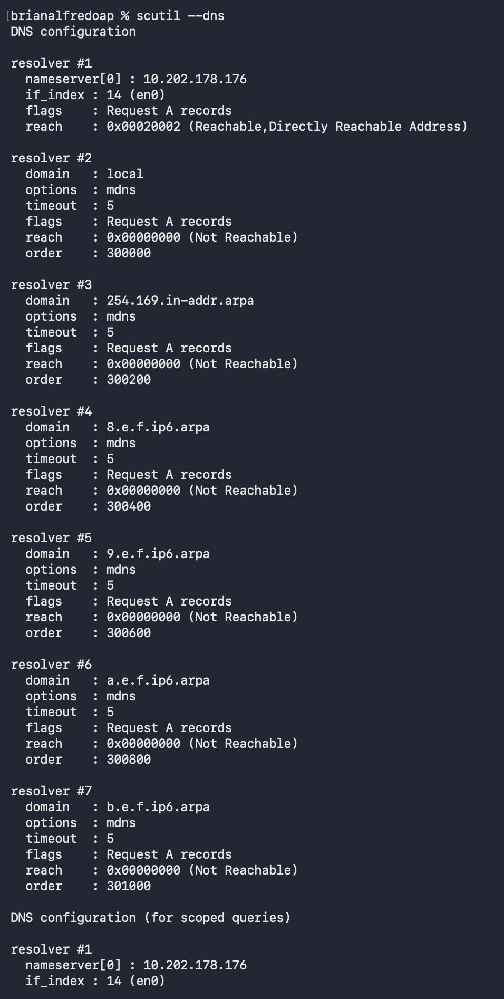

c. Untuk menghapus cache DNS, jalankan perintah berikut "
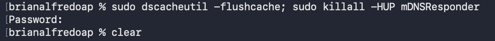

Setelah menjalankan perintah untuk menghapus cache DNS, tidak muncul output pada terminal, yang menandakan bahwa perintah berhasil dijalankan tanpa error.

## Tracing DNS dengan Wireshark
1. Analisis DNS Request dan Response pada Akses Website (www.ietf.org)
1.1 Cara Penggunaan ifconfig untuk analisis Website www.ietf.org:

a. Buka Terminal dan ketikan perintah ifconfig untuk menyalin IP Address
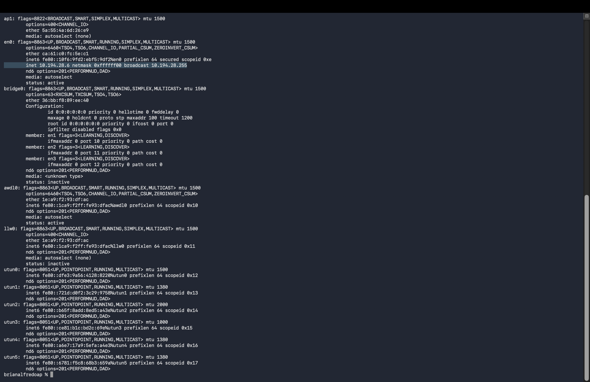
ip saya adalah 10.194.28.6

b. Buka Wireshark dan pilih jaringan yang aktif (WiFi/en0)

c. Buka browser http://www.ietf.org
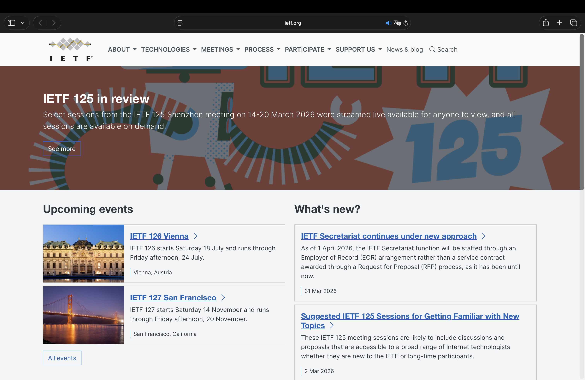

d. Tambahkan filter lagi ip.addr == 10.194.28.6 && dns
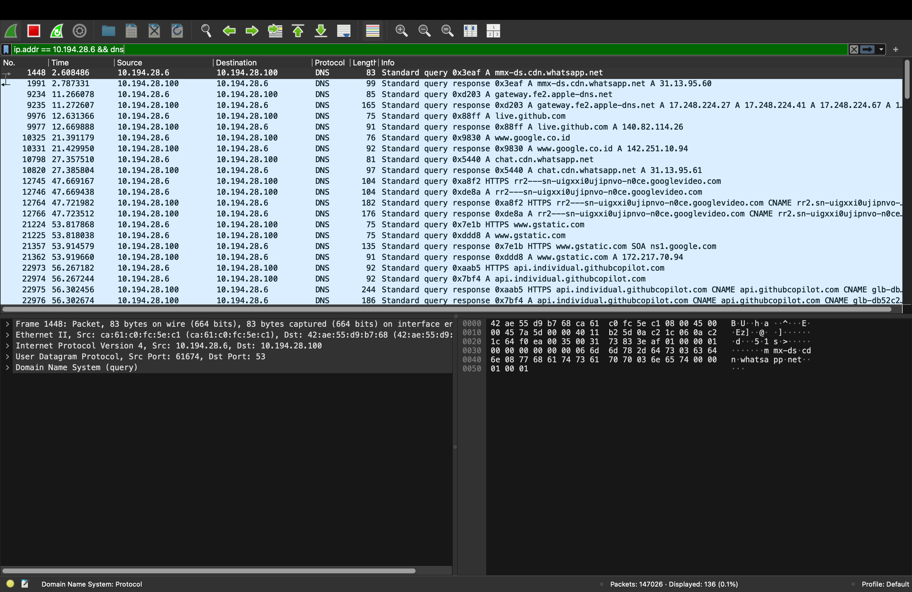

1.2 Pertanyaan:

a. Cari pesan permintaan DNS dan balasannya. Apakah pesan tersebut dikirimkan melalui UDP
atau TCP?
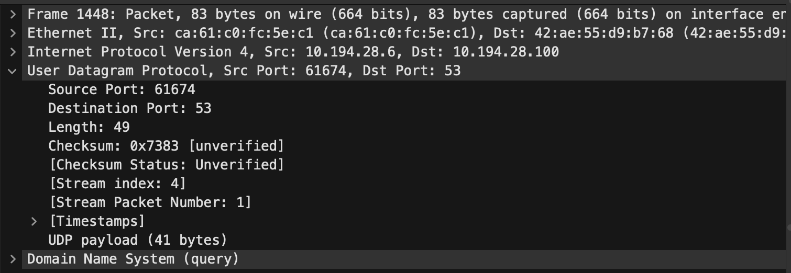
DNS menggunakan UDP

b.  Apa port tujuan pada pesan permintaan DNS? Apa port sumber pada pesan balasannya?

DNS Request adalah Source Port (client): 61674 & Destination Port (server): 53

c. Pada pesan permintaan DNS, apa alamat IP tujuannya? Apa alamat IP server DNS lokal anda
(gunakan ipconfig untuk mencari tahu)? Apakah kedua alamat IP tersebut sama?
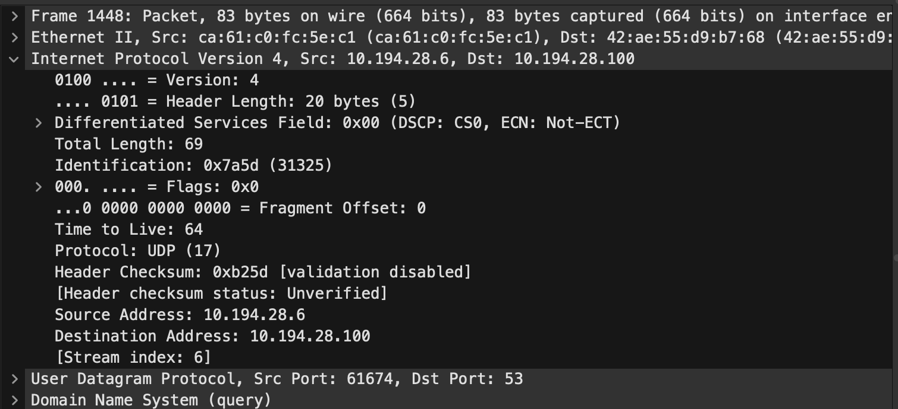
Pesan DNS dikirim ke alamat IP 10.194.28.100. kedua alamat IP tersebut sama, karena request dikirim ke DNS server lokal.

d. Periksa pesan permintaan DNS. Apa “jenis” atau ”type” dari pesan tersebut? Apakah pesan
permintaan tersebut mengandung ”jawaban” atau ”answers”?
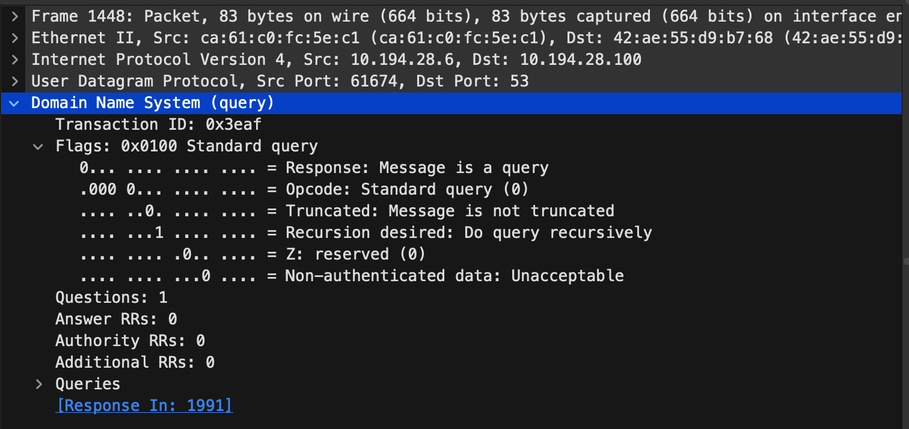
Tipe DNS request adalah A (Address Record), pesan permintaan tersebut tidak mengandung jawaban (answers), hal ini terlihat dari:
Answer RRs: 0 yang menunjukkan bahwa tidak ada jawaban pada pesan request.

e. Periksa pesan balasan DNS. Berapa banyak ”jawaban” atau ”answers” yang terdapat di
dalamnya? Apa saja isi yang terkandung dalam setiap jawaban tersebut?
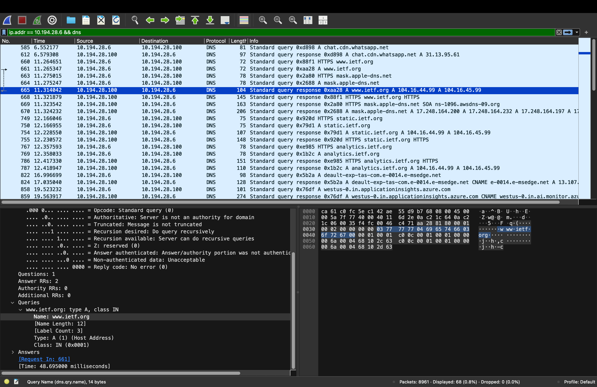
Terdapat 2 jawaban (answers) pada DNS response, yaitu alamat IP dari domain www.ietf.org, yaitu:
- 104.16.44.99
- 104.16.45.99

f. Perhatikan paket TCP SYN yang selanjutnya dikirimkan oleh host Anda. Apakah alamat IP
pada paket tersebut sesuai dengan alamat IP yang tertera pada pesan balasan DNS?
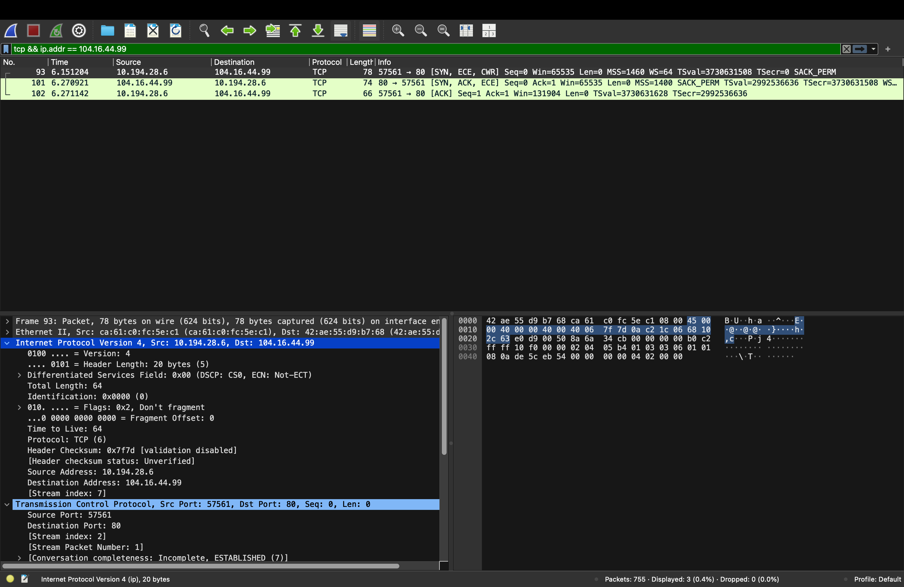
Alamat IP pada paket TCP SYN sesuai dengan alamat IP yang diperoleh dari DNS response, yaitu 104.16.44.99 atau 104.16.45.99. Jadi hasil dari DNS digunakan oleh host untuk melakukan koneksi ke server tujuan melalui protokol TCP.

g. Halaman web yang sebelumnya anda akses (http://www.ietf.org) memuat beberapa
gambar. Apakah host Anda perlu mengirimkan pesan permintaan DNS baru setiap kali ingin
mengakses suatu gambar?
Tidak, host tidak perlu mengirimkan pesan permintaan DNS baru setiap kali ingin mengakses gambar pada halaman web. Karena Browser menyimpan hasil DNS dalam DNS cache. Jika gambar berasal dari domain yang sama, yaitu www.ietf.org, maka alamat IP yang sudah diperoleh sebelumnya akan digunakan kembali, sehingga tidak perlu melakukan query DNS ulang untuk setiap objek

2. Analisis DNS Menggunakan Perintah nslookup (www.mit.edu)

2.1 Cara Penggunaan nslookup www.mit.edu:
a. Buka Wireshark dan pilih jaringan yang aktif (WiFi/en0)

b. Buka Terminal ketikan perintah nslookup www.mit.edu
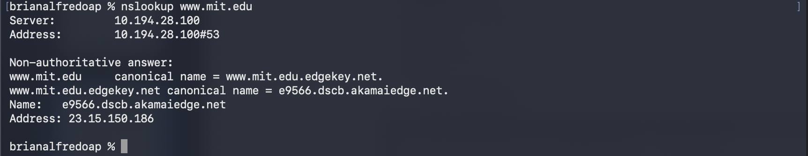

c. Matikan Wireshark dan gunakan filter DNS
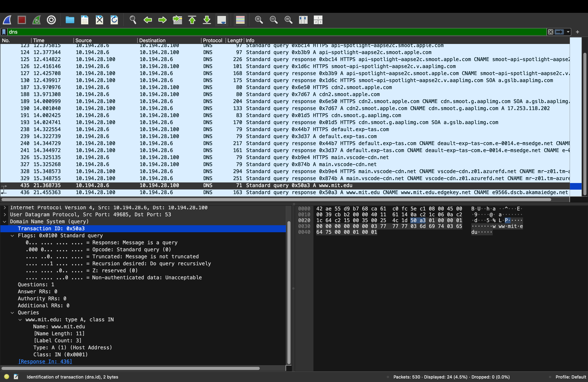

2.2 Pertanyaan:

a. Apa port tujuan pada pesan permintaan DNS? Apa port sumber pada pesan balasan DNS?
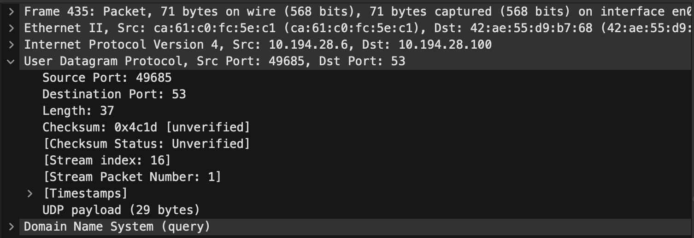
DNS Request, Destination Port: 53 dan DNS Response, Source Port: 49685

b. Ke alamat IP manakah pesan permintaan DNS dikirimkan? Apakah alamat IP tersebut
merupakan default alamat IP server DNS lokal Anda?
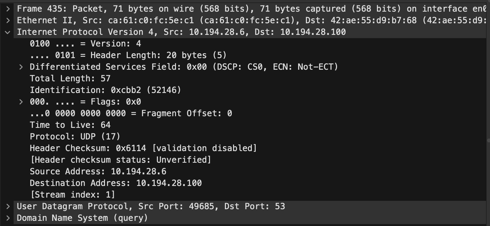
Pesan permintaan DNS dikirim ke alamat IP 10.194.28.100. Alamat tersebut merupakan DNS server lokal yang digunakan pada jaringan.

c. Periksa pesan permintaan DNS. Apa ”jenis” atau ”type” dari pesan tersebut? Apakah pesan
tersebut mengandung ”jawaban” atau ”answers”?
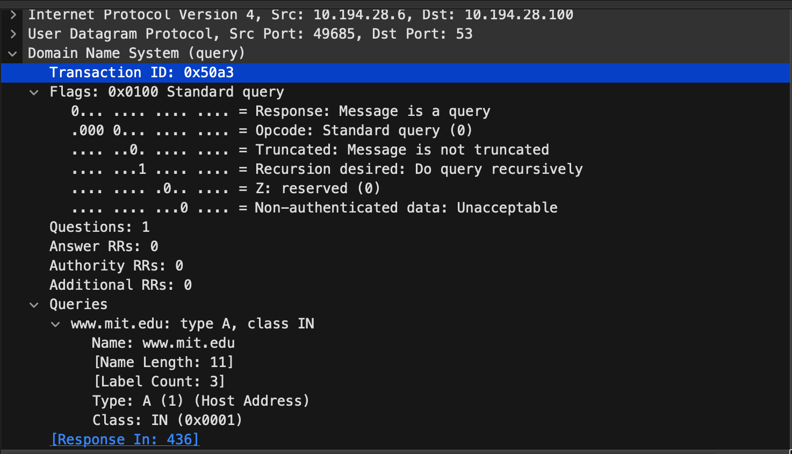
Tipe DNS request adalah A (Address Record). Pesan ini tidak mengandung jawaban karena hanya berupa permintaan, jadi terlihat dari tidak adanya bagian Answers.

d. Periksa pesan balasan DNS. Berapa banyak ”jawaban” atau “answers” yang terdapat di
dalamnya. Apa saja isi yang terkandung dalam setiap jawaban tersebut?
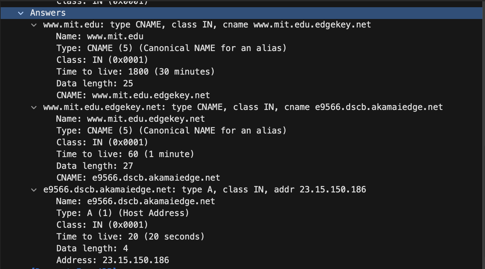
Terdapat 3 jawaban (answers) pada DNS response.
- Jawaban pertama menunjukkan domain www.mit.edu merupakan alias (CNAME) dari www.mit.edu.edgekey.net.
- Jawaban kedua menunjukkan alias lanjutan ke e9566.dscb.akamaiedge.net.
- Jawaban ketiga berisi alamat IP (A record) yaitu 23.15.150.186 sebagai alamat tujuan akhir.

3. Analisis DNS Record NS Menggunakan nslookup (mit.edu)

3.1 Cara Penggunaan nslookup -type=NS mit.edu:

a. Buka Wireshark dan pilih jaringan yang aktif (WiFi/en0)

b. Buka Terminal ketikan perintah nslookup -type=NS mit.edu
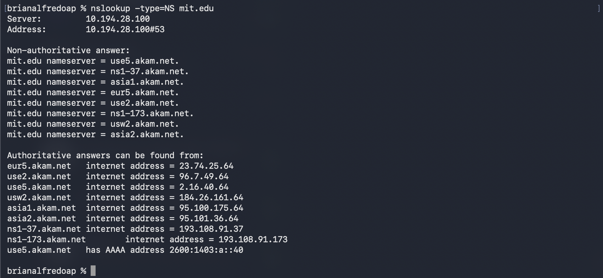

c. Matikan Wireshark dan gunakan filter DNS
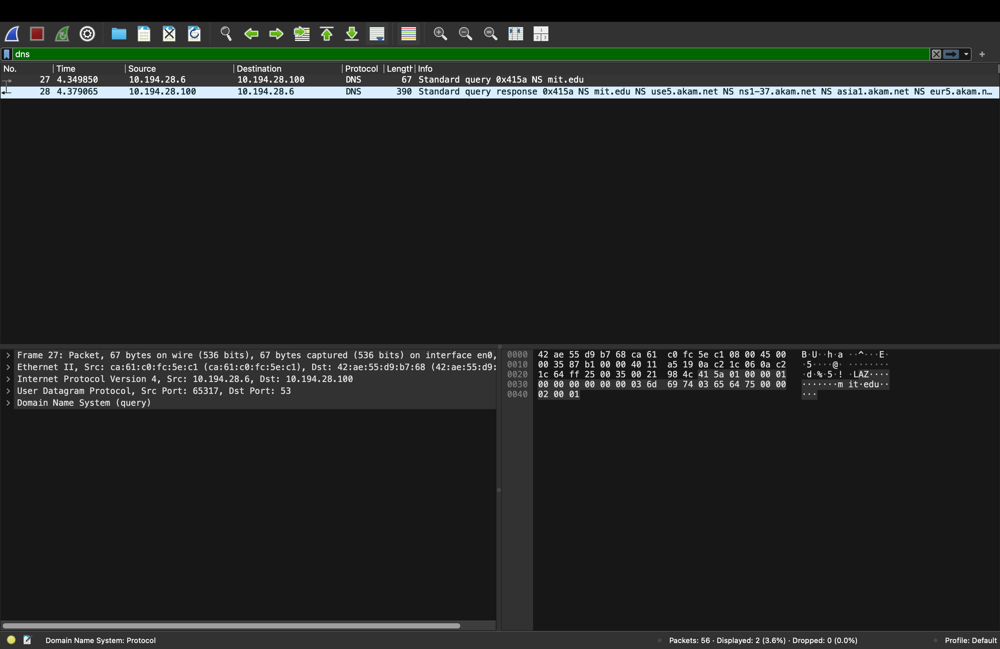

3.2 Pertanyaan:

a. Ke alamat IP manakah pesan permintaan DNS dikirimkan? Apakah alamat IP tersebut merupakan default alamat IP server DNS lokal Anda?
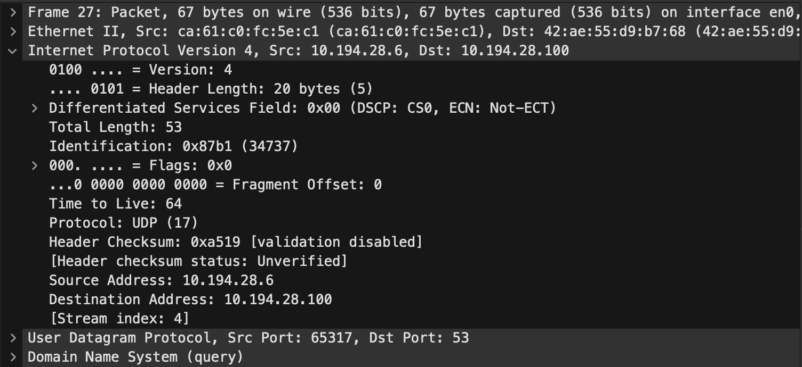
Request DNS dikirim ke alamat IP 10.194.28.100. Alamat tersebut merupakan DNS server lokal pada jaringan.

b. Periksa pesan permintaan DNS. Apa ”jenis” atau ”type” dari pesan tersebut? Apakah pesan
tersebut mengandung ”jawaban” atau ”answers”?
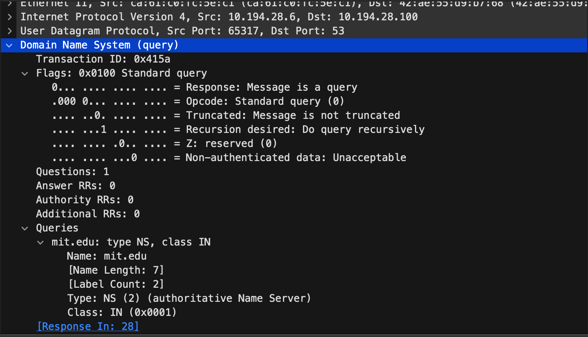
Tipe DNS request adalah NS (Name Server). Pesan tersebut tidak mengandung jawaban (answers) karena hanya berupa permintaan.

c. Periksa pesan balasan DNS. Apa nama server MIT yang diberikan oleh pesan balasan?
Apakah pesan balasan ini juga memberikan alamat IP untuk server MIT tersebut?
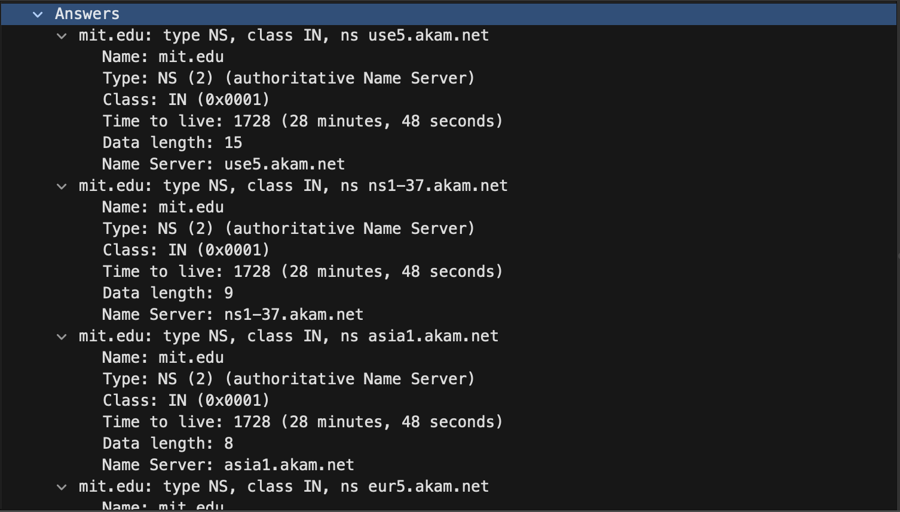
Pesan balasan DNS memberikan beberapa nama server MIT seperti use5.akam.net dan ns1-37.akam.net. Pesan ini tidak langsung memberikan alamat IP pada bagian answers, melainkan hanya nama server (NS record).

4. Analisis DNS Menggunakan Server Tertentu (www.aiit.or.kr bitsy.mit.edu)

4.1 Cara Penggunaan nslookup www.aiit.or.kr bitsy.mit.edu:

a. Buka Wireshark dan pilih jaringan yang aktif (WiFi/en0)

b. Buka Terminal ketikan nslookup www.aiit.or.kr bitsy.mit.edu (menggunakan DNS publik karena server bitsy.mit.edu tidak merespon)

c. Matikan Wireshark dan gunakan filter DNS
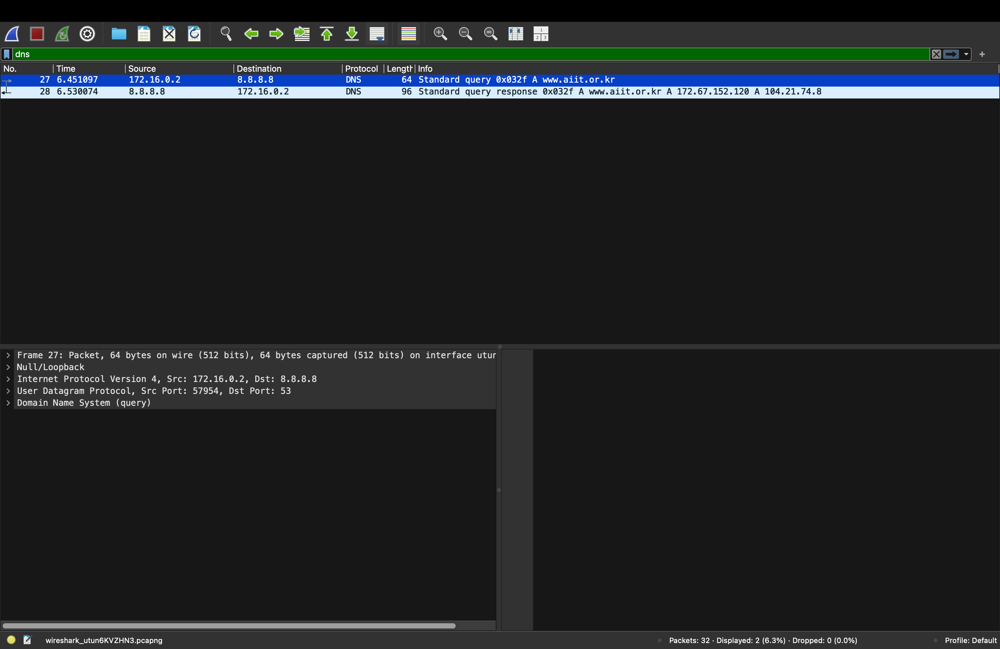

4.2 Pertanyaan:

a. Ke alamat IP manakah pesan permintaan DNS dikirimkan? Apakah alamat IP tersebut
merupakan default alamat IP server DNS lokal Anda?
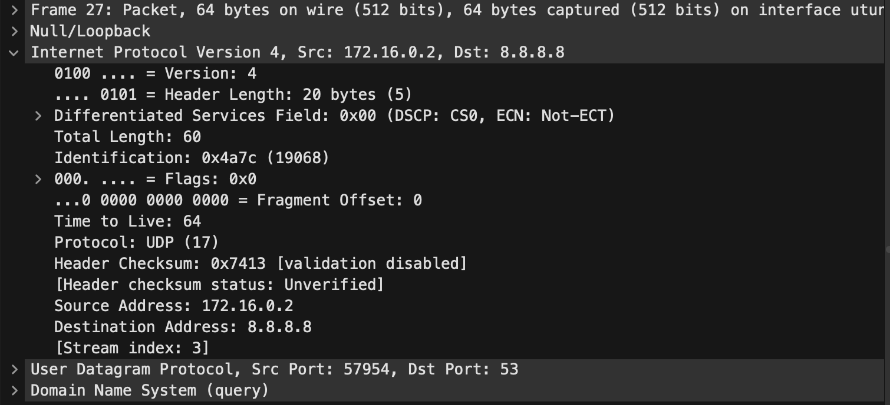
Pesan permintaan DNS dikirim ke alamat IP 8.8.8.8. Alamat tersebut bukan merupakan DNS server lokal, melainkan DNS publik milik Google.

b. Periksa pesan permintaan DNS. Apa ”jenis” atau ”type” dari pesan tersebut? Apakah pesan
tersebut mengandung ”jawaban” atau ”answers”?
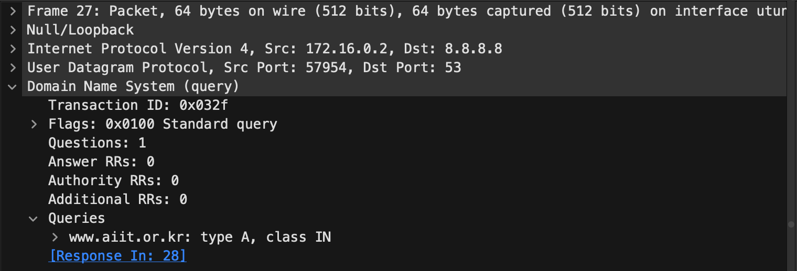
Tipe DNS request adalah A (Address Record). Pesan tersebut tidak mengandung jawaban (answers) karena hanya berupa permintaan.

c.  Periksa pesan balasan DNS. Berapa banyak ”jawaban” atau “answers” yang terdapat di
dalamnya. Apa saja isi yang terkandung dalam setiap jawaban tersebut?
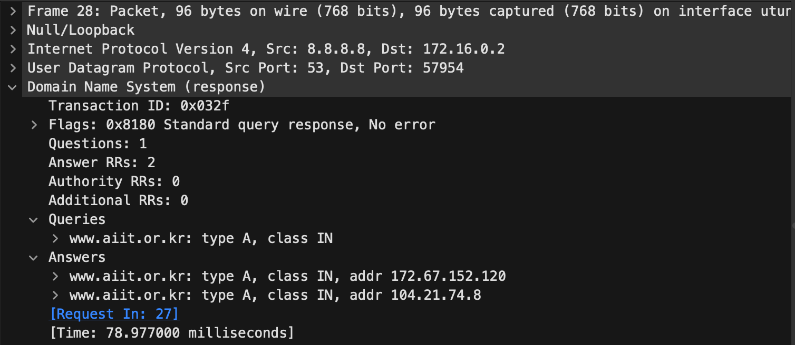
Terdapat 2 jawaban (answers) pada DNS response. Isi dari jawaban tersebut adalah alamat IP dari domain www.aiit.or.kr, yaitu 172.67.152.120 dan 104.21.74.8.

## Terima Kasih