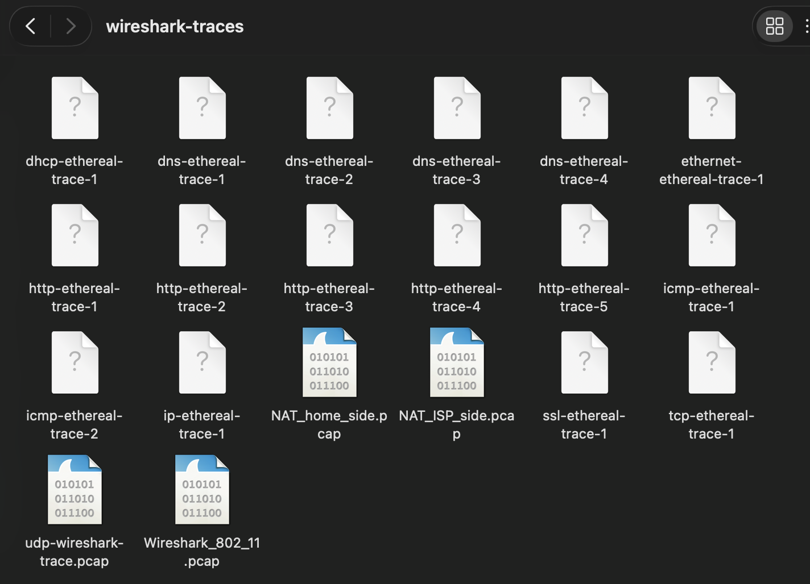
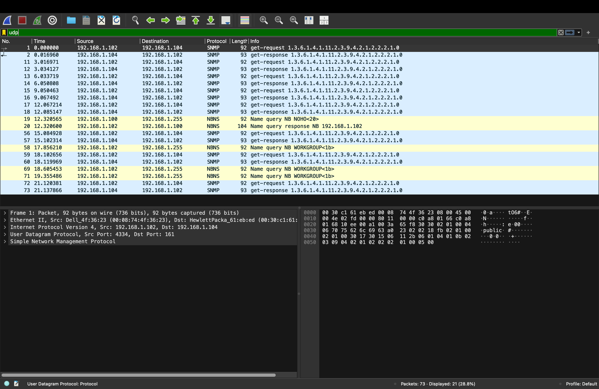
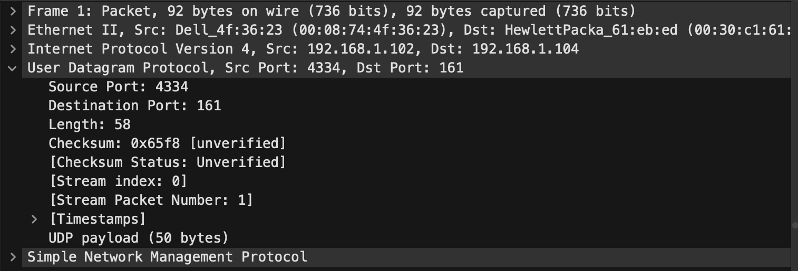
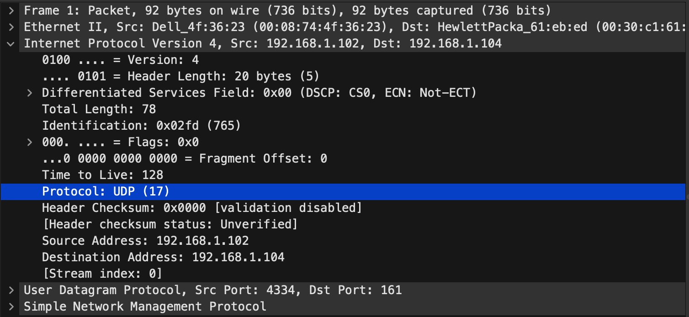

Nama    : Brian Alfredo Adhita Putra 
NIM     : 103072400165

# Modul 5 - UDP

## Tujuan Praktikum
Mahasiswa dapat menginvestigasi cara kerja protokol UDP menggunakan Wireshark

## UDP
User Datagram Protocol merupakan protokol pada layer transport yang bersifat sederhana dan tidak kompleks. UDP bekerja tanpa membangun koneksi terlebih dahulu (connectionless), sehingga proses pengiriman data menjadi lebih cepat, namun tidak menjamin keandalan seperti TCP.

Cara Penggunaan:

a. Download file http://gaia.cs.umass.edu/wireshark-labs/wireshark-traces.zip

b. Buka file tersebut lalu pilih http-ethereal-trace-5

Klik kanan, open with menggunakan wireshark

c. Tampilan di wireshark akan seperti ini

Lakukan filter udp

Pertanyaan:

a.  Pilih satu paket UDP yang terdapat pada trace Anda. Dari paket tersebut, berapa banyak “field” yang terdapat pada header UDP? Sebutkan nama-nama field yang Anda temukan!

terdapat 4 field, yaitu:
- Source Port
- Destination Port
- Length
- Checksum

b. Perhatikan informasi “content field” pada paket yang Anda pilih di pertanyaan 1. Berapa
panjang (dalam satuan byte) masing-masing “field” yang terdapat pada header UDP?

Teori UDP:
- Source Port = 2 byte
- Destination Port = 2 byte
- Length = 2 byte
- Checksum = 2 byte
total panjang header UDP adalah 8 byte.

Nilai Length = 58 byte
UDP payload = 50 byte
Jadi, 58 - 8 = 50 byte. Ini menunjukkan kalau nilai Length merupakan total panjang UDP, yaitu gabungan antara header dan data (payload).

c. Nilai yang tertera pada ”Length” menyatakan nilai apa? Verfikasi jawaban Anda melalui
paket UDP pada trace.

Nilai pada field Length menunjukkan total panjang segmen UDP, yaitu header ditambah data. Length = 58 byte
Header = 8 byte, jadi Payload = 58 - 8 = 50 byte

d. Berapa jumlah maksimum byte yang dapat disertakan dalam payload UDP? (Petunjuk:
jawaban untuk pertanyaan ini dapat ditentukan dari jawaban Anda untuk pertanyaan 2)

Perhitungan maksimum payload UDP:
- Maksimum IP = 65535 byte
- Header IP = 20 byte
- Header UDP = 8 byte
jadi, 65535 - 20 - 8 = 65507 byte. Sehingga maksimum payload UDP adalah 65507 byte.

e. Berapa nomor port terbesar yang dapat menjadi port sumber? (Petunjuk: lihat petunjuk pada pertanyaan 4)

Karena field port berukuran 16 bit, jadi 2^16 - 1 = 65535. Sehingga nomor port terbesar adalah 65535.

f. Berapa nomor protokol untuk UDP? Berikan jawaban Anda dalam notasi heksadesimal dan desimal. Untuk menjawab pertanyaan ini, Anda harus melihat ke bagian ”Protocol” pada datagram IP yang mengandung segmen UDP.

- Desimal = 17
- Heksadesimal = 0x11

g. UDP kedua merupakan balasan dari paket UDP yang pertama. (Petunjuk: agar paket kedua merupakan balasan dari paket pertama pengirim paket pertama harus menjadi tujuan dari paket kedua). Jelaskan hubungan antara nomor port pada kedua paket tersebut!

Paket pertama (request):
- Source Port: 4334
- Destination Port: 161
Paket kedua (response):
- Source Port: 161
- Destination Port: 4334
Terlihat bahwa pada paket balasan, nomor port dibalik antara source dan destination. Jadi, port tujuan pada request menjadi port sumber pada response sedangkan port sumber pada request menjadi port tujuan pada response. Hal ini menunjukkan hubungan request dan response pada komunikasi UDP.

## Terima Kasih