Nama    : Brian Alfredo Adhita Putra 
NIM     : 103072400165

# Modul 6 - TCP

## Tujuan Praktikum
Mahasiswa dapat menginvestigasi cara kerja protokol TCP menggunakan Wireshark

## TCP
Transmission Control Protocol adalah protokol di layer transport yang sifatnya connection-oriented, jadi sebelum kirim data harus bikin koneksi dulu. TCP juga bikin pengiriman data jadi lebih aman dan terjamin, karena pakai sequence number, acknowledgment, serta ada flow control dan congestion control buat ngatur aliran dan kepadatan data di jaringan.

## Analisis Tcp

Cara Penggunaan:
1. Download file http://gaia.cs.umass.edu/wireshark-labs/alice.txt

2. Buka browser http://gaia.cs.umass.edu/wireshark-labs/TCP-wireshark-file1.html
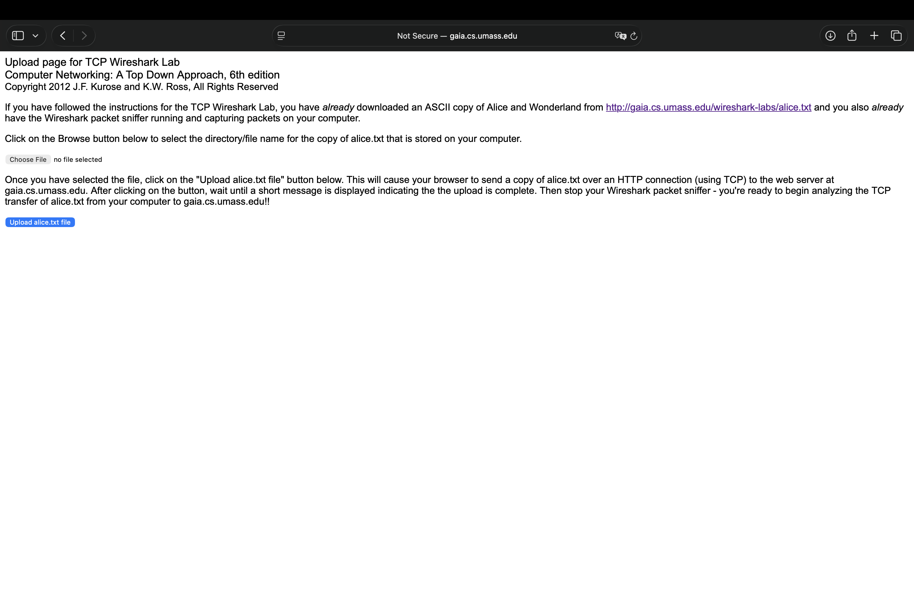

3. Buka Wireshark dan pilih jaringan yang aktif (WiFi/en0)

4. Unggah file alice di browser, dengan cara choose file lalu pilih file alice yang telah kalian download setelah itu klik upload
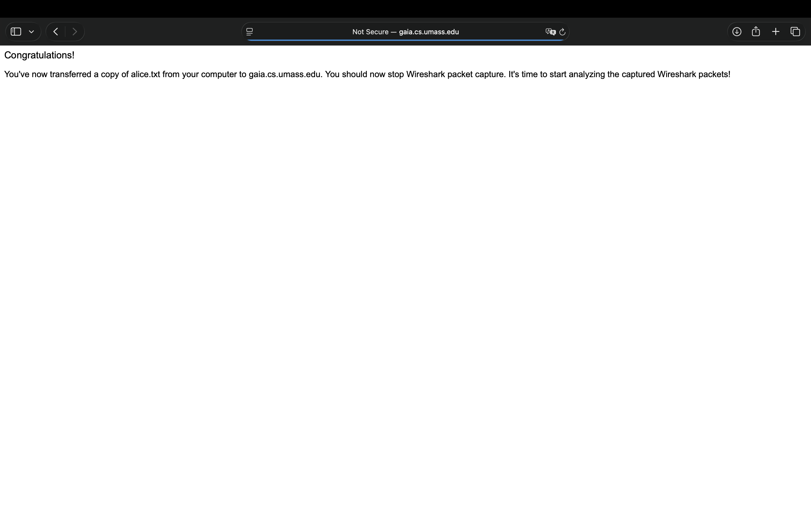

5. Kembali ke Wireshark lalu hentikan proses capture dan lakukan filter tcp
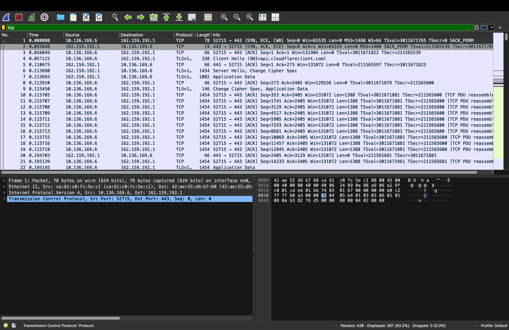
Pada awal komunikasi terdapat proses three-way handshake (SYN, SYN-ACK, ACK) yang menandakan pembentukan koneksi antara client dan server. Selain itu, terlihat adanya protokol TLS seperti Client Hello dan Server Hello yang menunjukkan bahwa komunikasi menggunakan HTTPS. Data juga dikirim dalam beberapa segmen kecil, yang merupakan mekanisme TCP untuk menjaga efisiensi dan keandalan transmisi.

    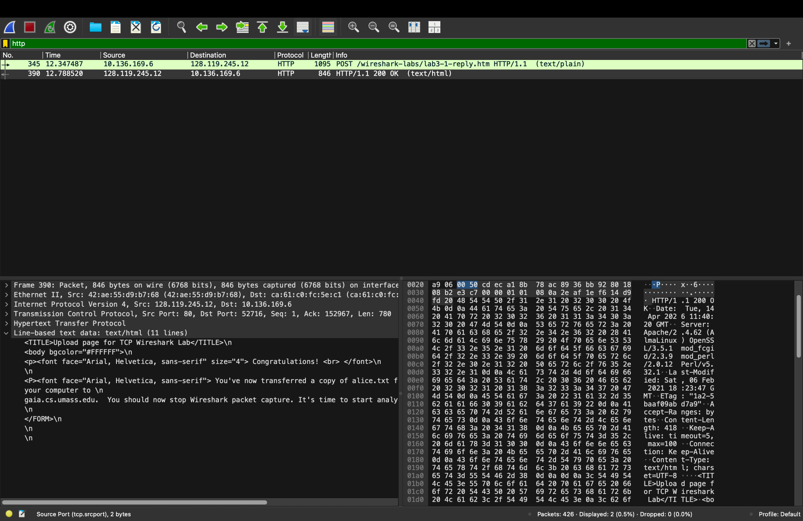
    Server memberikan respon HTTP/1.1 200 OK yang menandakan bahwa permintaan telah berhasil diproses. Pada bagian isi paket juga terlihat pesan “Congratulations”, yang menunjukkan bahwa file berhasil diunggah ke server.

Pertanyaan:
1. Berapa alamat IP dan nomor port TCP yang digunakan oleh komputer klien (sumber) untuk mentransfer file ke gaia.cs.umass.edu?
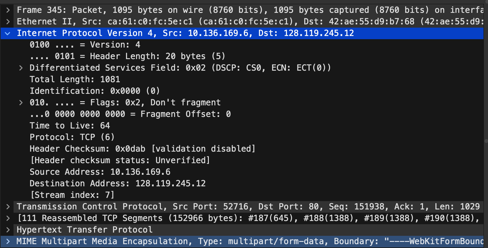
IP client adalah 10.136.169.6 dengan port 52716, sedangkan IP server 128.119.245.12 menggunakan port 80.

2. Apa alamat IP dari gaia.cs.umass.edu?
Alamat IP dari gaia.cs.umass.edu dapat dilihat pada bagian Destination (Dst) pada paket, yaitu 128.119.245.12.

3. Berapa alamat IP dan nomor port TCP yang digunakan oleh komputer klien Anda (sumber) untuk mentransfer ke gaia.cs.umass.edu?
Alamat IP komputer klien saya adalah 10.136.169.6 dengan nomor port TCP 52716. Port ini merupakan port dinamis yang digunakan oleh client saat melakukan koneksi ke server gaia.cs.umass.edu.

## Dasar TCP

Cara Penggunaan:

1. Download file http://gaia.cs.umass.edu/wireshark-labs/wireshark-traces.zip

2. Buka file tersebut lalu pilih http-ethereal-trace-1

Klik kanan, open with menggunakan wireshark

3. Tampilannya akan seperti ini
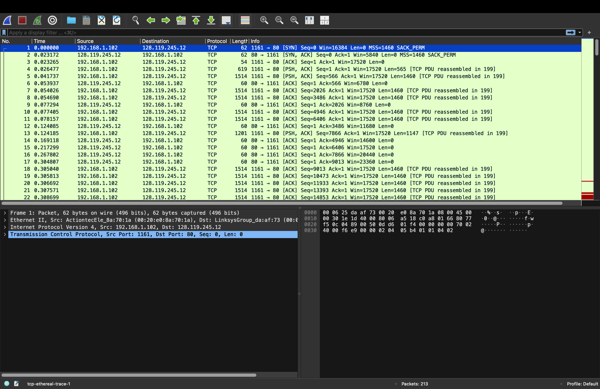

Pertanyaan:

1. Berapa nomor urut segmen TCP SYN yang digunakan untuk memulai sambungan TCP antara komputer klien dan gaia.cs.umass.edu? Apa yang dimiliki segmen tersebut sehingga teridentifikasi sebagai segmen SYN?
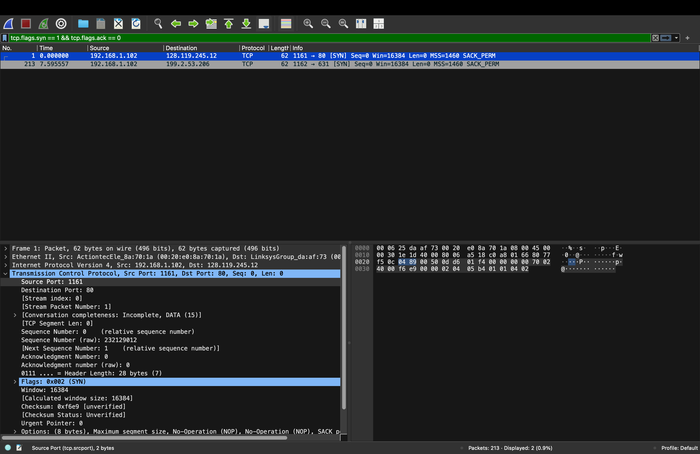
Sequence number = 0, karena flag SYN aktif.

2. Berapa nomor urut segmen SYNACK yang dikirim oleh gaia.cs.umass.edu ke komputer klien sebagai balasan dari SYN? Berapa nilai dari field Acknowledgement pada segmen  YNACK? Bagaimana gaia.cs.umass.edu menentukan nilai tersebut? Apa yang dimiliki oleh segmen sehingga teridentifikasi sebagai segmen SYNACK?
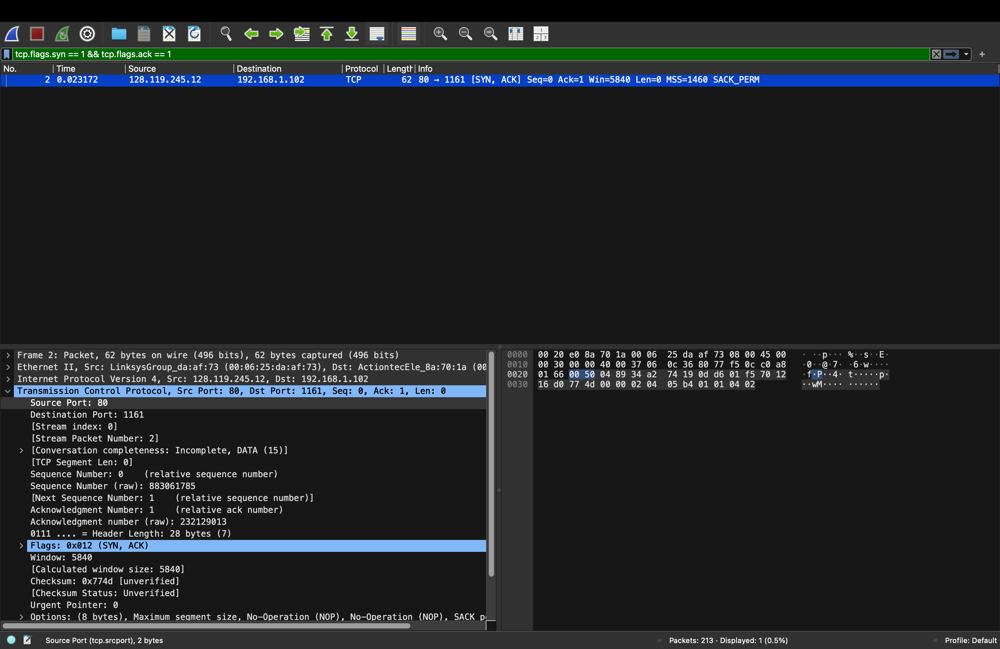
Sequence = 0, ACK = 1 (Seq SYN + 1), karena flag SYN dan ACK aktif.

3. Berapa nomor urut segmen TCP yang berisi perintah HTTP POST? Perhatikan bahwa untuk menemukan perintah POST, Anda harus menelusuri content field milik paket di bagian bawah jendela Wireshark, kemudian cari segmen yang berisi "POST" di bagian field DATA- nya.
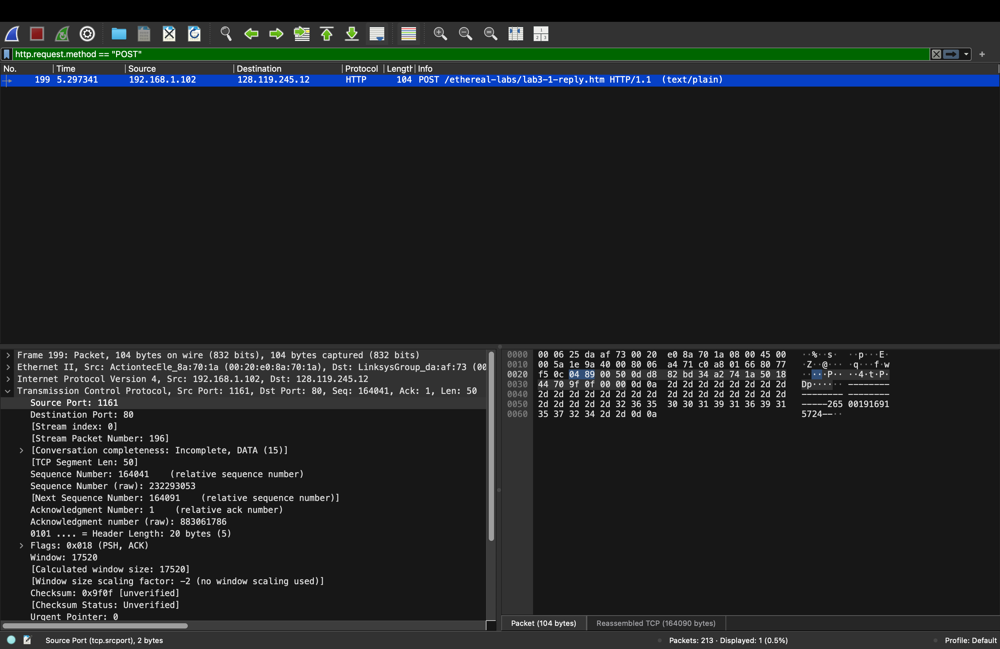
Nomor urut segmen TCP yang berisi POST adalah 1.

4. Anggap segmen TCP yang berisi HTTP POST sebagai segmen pertama dalam koneksi TCP. Berapa nomor urut dari enam segmen pertama dalam TCP (termasuk segmen yang berisi HTTP POST)? Pada jam berapa setiap segmen dikirim? Kapan ACK untuk setiap segmen diterima? Dengan adanya perbedaan antara kapan setiap segmen TCP dikirim dan kapan acknowledgement-nya diterima, berapakah nilai RTT untuk keenam segmen tersebut? Berapa nilai EstimatedRTT setelah penerimaan setiap ACK?
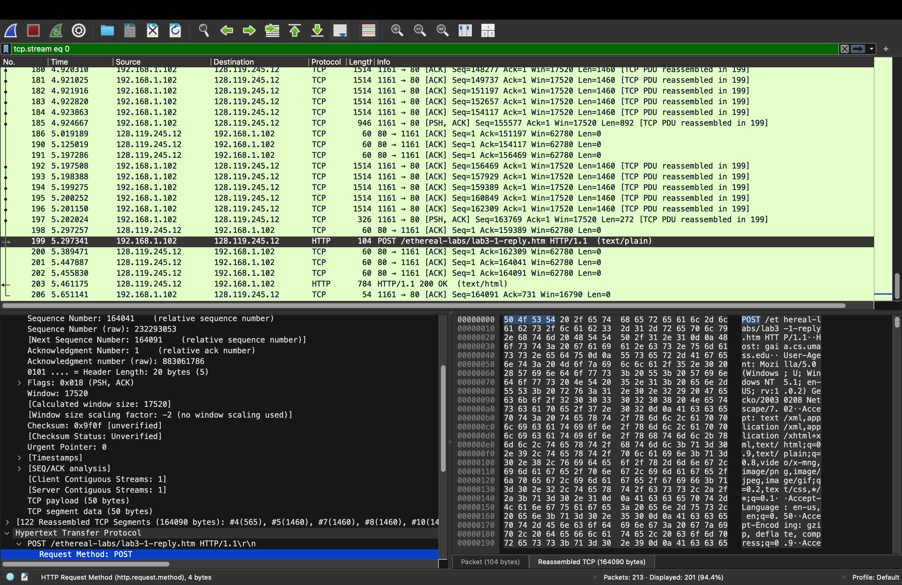
Sequence number meningkat dari 1, RTT berkisar 0.1 – 0.3 detik, Estimated RTT stabil mengikuti rata-rata RTT

5. Berapa panjang setiap enam segmen TCP pertama?

    Bisa dilihat di ss no 4 kalau, panjang total 6 segmen pertama sekitar ±7.800 byte, dengan tiap segmen mendekati 1460 byte (MSS).

6. Berapa jumlah minimum ruang buffer tersedia yang disarankan kepada penerima dan diterima untuk seluruh trace? Apakah kurangnya ruang buffer penerima pernah menghambat pengiriman?

    Sama di no 5 bisa di lihat ss nya di no 4 bahwa nilai minimum buffer sekitar 5840 byte dan tidak terjadi hambatan pengiriman.

7. Apakah ada segmen yang ditransmisikan ulang dalam file trace? Apa yang anda periksa (di dalam file trace) untuk menjawab pertanyaan ini?
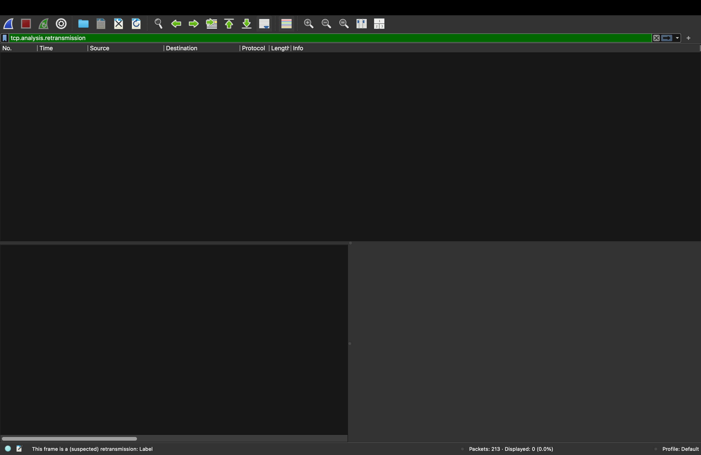
Tidak ditemukan retransmission karena tidak ada label tersebut pada trace.

8. Berapa banyak data yang biasanya diakui oleh penerima dalam ACK? Dapatkah anda
mengidentifikasi kasus-kasus di mana penerima melakukan ACK untuk setiap segmen yang
diterima?
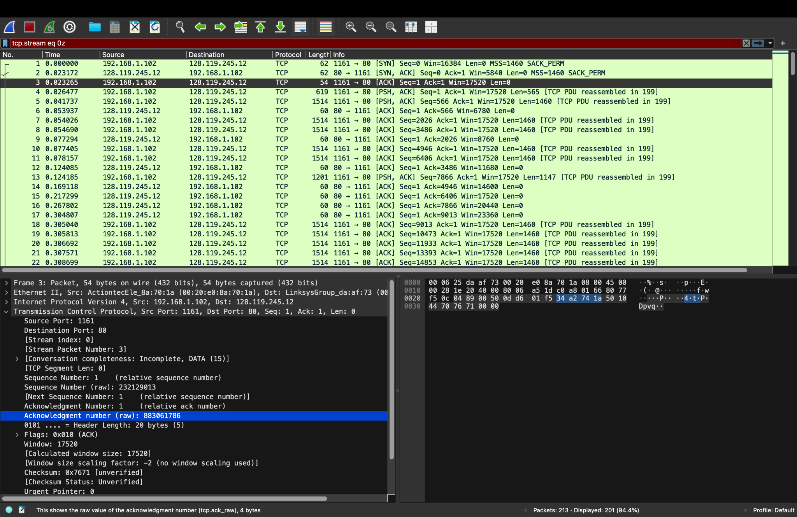
Nilai acknowledgment number tidak selalu meningkat satu per satu, tapi meningkat dalam jumlah besar. Ini menunjukkan kalau mekanisme ACK pada TCP bersifat kumulatif, dimana satu ACK dapat mengakui beberapa segmen data sekaligus.

9. Berapa throughput (byte yang ditransfer per satuan waktu) untuk sambungan TCP?
Jelaskan bagaimana Anda menghitung nilai ini.
 Klik Statistics -> TCP Stream Graph -> Throughtput
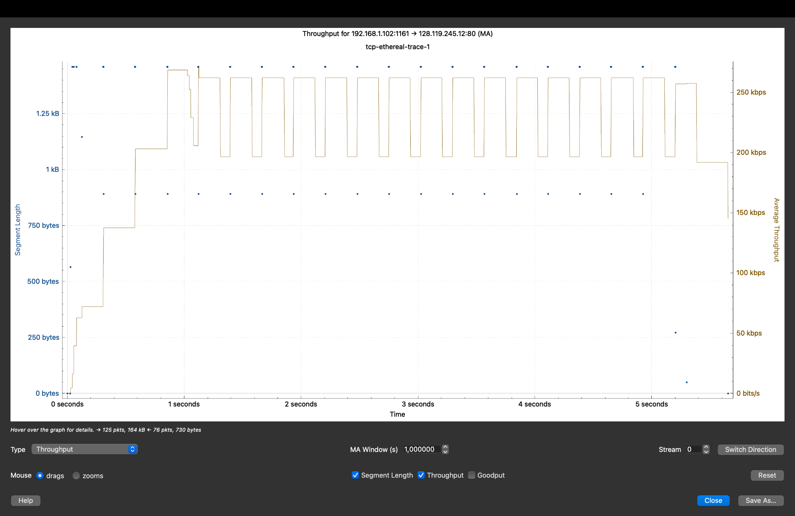
Grafik throughput menunjukkan peningkatan kecepatan di awal (slow start), kemudian stabil dengan sedikit fluktuasi (congestion avoidance), dan menurun di akhir saat transfer selesai. Pola naik turun terjadi karena proses pengiriman data dan penerimaan ACK pada TCP.

## Congestion Control pada TCP

Pertanyaan:

1. Gunakan alat plotting Time-Sequence-Graph (Stevens) untuk melihat grafik nomor urut berbanding waktu dari segmen yang dikirim oleh klien ke server gaia.cs.umass.edu. Dapatkah Anda mengidentifikasi di mana fase “slow start” TCP dimulai dan berakhir, dan pada bagian mana algoritma ”congestion avoidance” mengambil alih? 
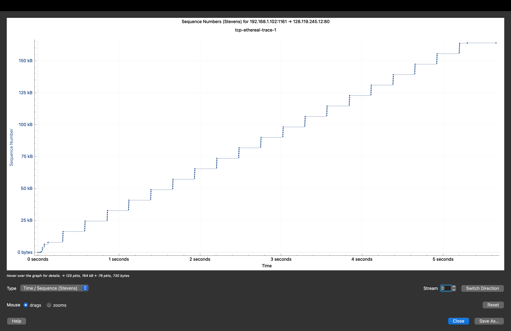
Pada grafik di awal ada peningkatan yang cepat, ini menunjukkan fase slow start. Setelah itu grafik menjadi lebih lurus dan stabil, yang menandakan masuk ke fase congestion avoidance. Pola seperti tangga terjadi karena proses kirim data lalu menunggu ACK secara bergantian.

2. Jawablah kedua pertanyaan di atas untuk trace yang Anda dapatkan ketika Anda
mengirimkan file dari komputer ke gaia.cs.umass.edu.
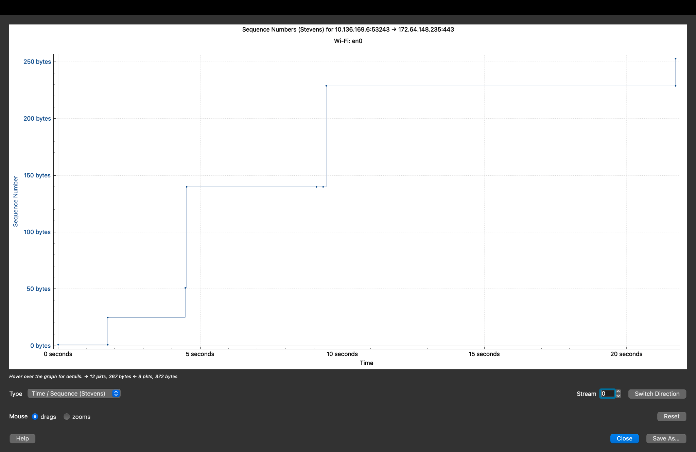
Pada grafik hasil kirim file ke gaia.cs.umass.edu, terlihat bahwa pada awal pengiriman terjadi peningkatan cepat (slow start). Setelah itu, grafik menjadi lebih stabil (congestion avoidance). Grafik tidak terlalu padat karena dipengaruhi oleh kondisi jaringan seperti delay.

## Terima Kasih