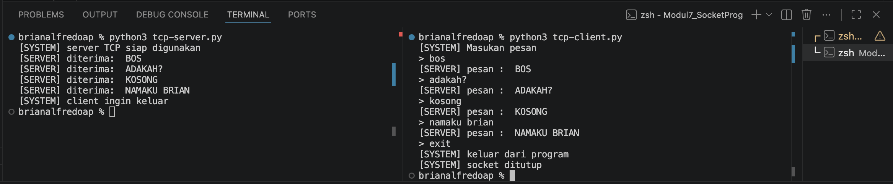
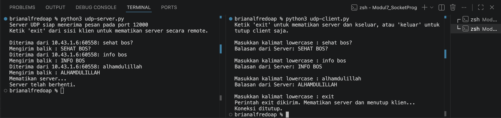

Nama    : Brian Alfredo Adhita Putra<br>
NIM     : 103072400165

# Modul 7 - SOCKET PROGRAMMING

## Tujuan Praktikum
1. Mahasiswa bisa membuat program berbasis socket UDP
2. Mahasiswa bisa membuat program berbasis socket TCP

## Pengertian Socket Programming
Socket programming adalah cara supaya dua komputer bisa saling berkomunikasi melalui jaringan dengan menggunakan socket sebagai jalurnya. Dalam proses ini biasanya ada dua peran, yaitu client yang mengirim pesan dan server yang menerima serta membalas pesan tersebut. Komunikasi ini bisa menggunakan protokol TCP yang lebih stabil dan menjamin data sampai, atau UDP yang lebih cepat tetapi tidak menjamin keakuratan pengiriman data. Intinya, socket programming memungkinkan pertukaran data antar perangkat dalam jaringan secara langsung.

## Implementasi TCP
### TCP Client
```python
from socket import * # import all libary

serverName = "localhost" # alamat server
serverPort = 12000 # membuat port untuk komunikasi

clientSocket = socket(AF_INET, SOCK_STREAM) # membuat socket ipv4 dan TCP
clientSocket.connect( # menghubungkan socket ke server
    (serverName, serverPort)
)

print("[SYSTEM] Masukan pesan") # pesan yang akan dikirim ke server

running = True # variabel untuk menjalankan program, jika false program akan berhenti
while running: # loop agar program terus berjalan
    message = input("> ") # input pesan yang akan dikirim ke server
    
    # mengirim pesan ke server, encode untuk mengubah string menjadi byte
    clientSocket.send(message.encode()) 
    if message == "exit": # pesan "exit" untuk keluar dari program
        print("[SYSTEM] keluar dari program")
        running = False # ubah variabel running menjadi false untuk keluar dari loop
        break

    modifiedMessage = clientSocket.recv(2048) # menerima pesan dari server, 2048 adalah ukuran buffer
    print("[SERVER] pesan : ", modifiedMessage.decode()) # decode untuk mengubah byte menjadi string

clientSocket.close() # menutup socket
print("[SYSTEM] socket ditutup")
```

### TCP Server
```python
from socket import * # import all library 

serverPort = 12000  # membuat port untuk komunikasi
serverSocket = socket(AF_INET, SOCK_STREAM) # membuat socket ipv4 dan TCP

serverSocket.bind( #menghubungkan socket dengan alamat dan port
    ('', serverPort) # alamat kosong 
)

serverSocket.listen(1) # server siap menerima 1 koneksi dari client
print("[SYSTEM] server TCP siap digunakan") # menampilkan pesan server siap digunakan

running = True # variabel untuk menjalankan program, jika false program akan berhenti
while running: # loop agar program terus berjalan
    connectionSocket, addr = serverSocket.accept() # menerima koneksi dari client, addr untuk menyimpan alamat client
    while True: # loop untuk menerima pesan dari client
        message = connectionSocket.recv(2448).decode() # menerima pesan dari client, decode untuk mengubah byte menjadi string

        if not message: # jika pesan kosong, berarti client sudah keluar
            break

        if message.lower() == "exit": # pesan "exit" untuk keluar dari program
            print("[SYSTEM] client ingin keluar") # menampilkan pesan client ingin keluar
            running = False # ubah variabel running menjadi false untuk keluar dari loop
            break

        modifiedMessage = message.upper() # mengubah pesan menjadi capslock
        print("[SERVER] diterima: ",modifiedMessage) # menampilkan pesan yang diterima dari client

        connectionSocket.send( # mengirim pesan ke client 
            modifiedMessage.encode() # encode untuk mengubah string menjadi byte
        )
        
    connectionSocket.close() # menutup koneksi dengan client
serverSocket.close() # menutup socket
```

### Alur TCP
1. Server dijalankan terlebih dahulu
2. Client melakukan koneksi ke server
3. Client mengirim data
4. Server memproses data
5. Server mengirim hasil ke client
6. Client menampilkan hasil

Contoh di terminal:


## Implementasi UDP
### UDP Client
```python
from socket import * # import all libary
import sys # import library sys untuk menangani error

serverName = '10.43.1.6' # alamat server saya
serverPort = 12000 # membuat port untuk komunikasi

clientSocket = socket(AF_INET, SOCK_DGRAM) # membuat socket ipv4 dan UDP
clientSocket.settimeout(5)  # batas waktu tunggu 5 detik

print("Ketik 'exit' untuk mematikan server dan keluar, atau 'keluar' untuk tutup client saja.\n")

try: # loop untuk menjalankan program terus menerus
    while True: # loop untuk menerima input dari pengguna
        message = input('Masukkan kalimat lowercase : ') # input pesan dari pengguna
        
        if not message: # validasi jika input kosong
            continue # jika input kosong maka ulangi input

        clientSocket.sendto(message.encode(), (serverName, serverPort))  # mengirim pesan ke server
        
        if message.lower() == 'exit': # cek apakah pengguna ingin keluar
            print("Perintah exit dikirim. Mematikan server dan menutup klien...")
            break
        elif message.lower() == 'keluar': # cek apakah pengguna ingin keluar
            print("Menutup klien...")
            break
        
        try:
            modifiedMessage, serverAddress = clientSocket.recvfrom(2048) # menerima balasan dari server
            print(f"Balasan dari Server: {modifiedMessage.decode()}\n") 
        except timeout: # jika server tidak merespons
            print("Kesalahan : Server tidak merespons (Timeout).\n")

except Exception as e: # menangani kalau terjadi error
    print(f"Terjadi kesalahan : {e}")
finally:
    clientSocket.close() # menutup koneksi socket secara permanen saat loop berhenti
    print("Koneksi ditutup.")
```

### UDP Server
```python
from socket import * # import all libary
import sys # import library sys untuk menangani error

serverPort = 12000 # membuat port untuk komunikasi
serverSocket = socket(AF_INET, SOCK_DGRAM) # membuat socket ipv4 dan UDP
serverSocket.bind(('', serverPort)) # server aktif di semua IP pada port 12000

print(f"Server UDP siap menerima pesan pada port {serverPort}") # menampilkan pesan server siap digunakan
print("Ketik 'exit' dari sisi klien untuk mematikan server secara remote.\n")

try: # loop untuk menjalankan server terus menerus
    while True: # loop untuk menerima pesan dari klien
        message, clientAddress = serverSocket.recvfrom(2048) # menerima pesan dari klien
        
        original_message = message.decode().strip() # mendekode pesan
        
        if original_message.lower() == 'exit': # cek apakah pesan adalah perintah untuk keluar
            print(f"Mematikan server...")
            break
    
        modifiedMessage = original_message.upper() # mengubah pesan menjadi capslock
        
        print(f"Diterima dari {clientAddress[0]}:{clientAddress[1]}: {original_message}") # Menampilkan informasi klien dan isi pesan
        print(f"Mengirim balik : {modifiedMessage}")
        
        serverSocket.sendto(modifiedMessage.encode(), clientAddress) # mengirim kembali pesan yang telah diubah ke klien
        
except Exception as e: # menangani kalau terjadi error
    print(f"\nTerjadi kesalahan : {e}")
finally:
    print("Server telah berhenti.")
    serverSocket.close() # menutup socket server secara permanen saat loop berhenti
    sys.exit(0) # Keluar dari program dengan status 0 (sukses)
```
### Alur UDP
1. Server dijalankan
2. Client langsung mengirim data tanpa koneksi
3. Server menerima data
4. Server memproses
5. Server mengirim balasan
6. Client menerima hasil

Contoh di terminal:


## Kesimpulan
Socket digunakan untuk komunikasi antar perangkat dalam jaringan. TCP cocok untuk data penting karena sebelum mengirim data harus membuat koneksi terlebih dahulu. Kelebihannya adalah data lebih aman, terjamin sampai, dan berurutan, tetapi prosesnya lebih lambat. Sedangkan UDP cocok untuk komunikasi cepat tanpa prioritas keakuratan karena tidak perlu membuat koneksi sehingga pengiriman data lebih cepat dan sederhana, namun tidak ada jaminan data sampai atau urut.

## Terima Kasih