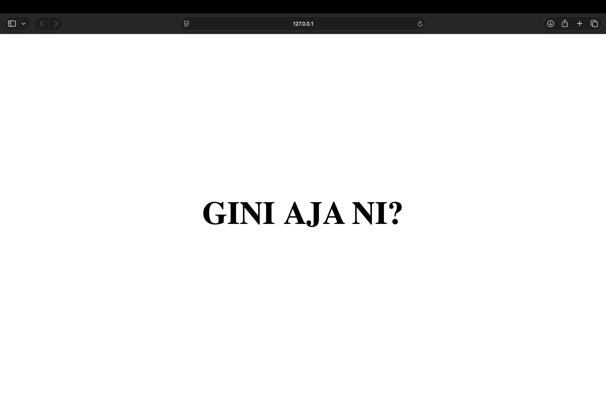

Nama    : Brian Alfredo Adhita Putra<br>
NIM     : 103072400165

# Modul 9 - WEB SERVER

## Tujuan Praktikum
1. Mahasiswa bisa membuat program web server sederhana berbasis TCP socket programming

## Apa itu Web Server
Web server adalah layanan atau program yang bertugas menerima permintaan dari browser pengguna, lalu mengirimkan halaman web atau data yang diminta. Sederhananya, web server berperan sebagai penghubung antara pengguna dan website sehingga informasi yang ada di server dapat ditampilkan di browser dengan menggunakan protokol HTTP atau HTTPS.

## Percobaan 1 : Web Server Sederhana
1. Membuat file serverweb.py.
2. Menuliskan program web server menggunakan socket TCP.
```python
from socket import *
import threading

def handle_client(connectionSocket):
        try:
            # menerima pesan user
            message = connectionSocket.recv(1024).decode() # decode itu 1010101010 = "message"
            
            #index.html, hello.html
            # message = "GET /index.html HTTP/1.1"
            filename = message.split()[1] # memisahkan pesan dengan spasi, lalu mengambil bagian kedua (nama file)
            #message = message[4:15]
            
            #membuka index.html serta menghilangkan "/"
            f = open(filename[1:])
            
            # membaca file html
            outputdata = f.read()
            
            # kirim respon
            connectionSocket.send("HTTP/1.1 200 OK\r\n\r\n".encode()) # mengirim header respon
            
            # kirim data
            connectionSocket.sendall(outputdata.encode()) 
            
            # tutup koneksi
            connectionSocket.close()
            
        except IOError:
            # kirim respon error
            connectionSocket.send("HTTP/1.1 404 Not Found\r\n\r\n".encode())
            
            #kirim data 404
            connectionSocket.send("<h1>404 Not Found</h1>".encode())
            
            # tutup koneksi
            connectionSocket.close()

serverSocket = socket(AF_INET, SOCK_STREAM)
serverSocket.bind(('', 6789))
serverSocket.listen(5) # dapat menerima sebanyak 5 client

while True:
    connectionSocket, addr = serverSocket.accept()
    #serverSocket.accept()
    
    # membuat thread dan target thread nya, beserta parameetr
    thread = threading.Thread(target=handle_client, args=(connectionSocket,))
    # menjalankan thread
    thread.start()
```
3. Membuat file index.html pada folder yang sama.
```html
<!DOCTYPE html>
<html>
<head>
    <title>My Server</title>
    <style>
        body {
            display: flex;
            justify-content: center; 
            align-items: center;     
            height: 100vh;
            margin: 0;
        }

        h1 {
            font-size: 80px; 
        }
    </style>
</head>

<body>
    <h1>GINI AJA NI?</h1>
</body>
</html>
```
4. Menjalankan server.py di terminal.
5. Run index.html dengan browser atau jalankan ini http://127.0.0.1:5500/Jarkom_Py/Modul9/index.html.

Server dapat menerima permintaan dari browser lalu menampilkan file HTML yang diminta. Server ini hanya bisa melayani satu pengguna dalam satu waktu.

## Percobaan 2 : Multithreaded Web Server
1. Membuat file server.py.
2. Menuliskan program web server menggunakan modul threading.
```python
from socket import *
import threading

def handle_client(connectionSocket):
    try:
        # menerima pesan user
        message = connectionSocket.recv(1024).decode() # decode = 10101010 = "message"

        # index.html, hello.html
        # message isinya = /GET /index.html HTTP/1.1
        message = message[4:15]
        print(message)
        # filename = message.split()[1]

        # membuka index.html serta menghilangkan "/"
        f = open(message[1:])

        # membaca file html
        outputData = f.read()

        # kirim respon
        connectionSocket.send(
            "HTTP/1.1 200 OK\r\n\r\n".encode()
        )

        # kirim data
        connectionSocket.sendall(outputData.encode())

        # tutup koneksi
        connectionSocket.close()
    
    except IOError:
        # kirim respon bila tidak ditemukan
        connectionSocket.send(
            "HTTP/1.1 404 Not Found\r\n\r\n".encode()
        )

        # kirim data
        connectionSocket.send(
            "<h1>404 Not Found</h1>".encode()
        )

        # tutup koneksinya
        connectionSocket.close()


serverSocket = socket(AF_INET, SOCK_STREAM)
serverSocket.bind(('', 6789))
serverSocket.listen(5) # dapat menerima sebanyak 5 client
print("[SYSTEM] server is running...")

while True:
    connectionSocket, addr =  serverSocket.accept()

    # membuat thread dan target threadnya, beseerta parameter
    thread = threading.Thread(
        target = handle_client,
        args = (connectionSocket,)
        )
    # menjalankan
    thread.start()
```
3. Membuat file index.html.
```html
<!DOCTYPE html>
<html>
<head>
    <title>My Server</title>
    <style>
        body {
            display: flex;
            justify-content: center; 
            align-items: center;     
            height: 100vh;
            margin: 0;
        }

        h1 {
            font-size: 80px; 
        }
    </style>
</head>

<body>
    <h1>DONE YA</h1>
</body>
</html>
```
4. Menjalankan server2.py terminal.
5. Run index.html dengan browser atau akses alamat http://127.0.0.1:5500/Jarkom_Py/Modul9/index2.html.

6. Membuka beberapa tab browser secara bersamaan untuk menguji kemampuan server.<br>
Server dikembangkan menggunakan multithreading. Dengan cara ini, setiap pengguna yang terhubung akan ditangani oleh thread yang berbeda sehingga beberapa permintaan bisa diproses secara bersamaan dan server bekerja lebih cepat.

## Kesimpulan
Memahami cara kerja dasar web server dalam menerima dan merespons permintaan dari browser. Selain itu, penggunaan multithreading membuat server lebih efisien karena dapat melayani banyak pengguna secara bersamaan.

## Terima Kasih