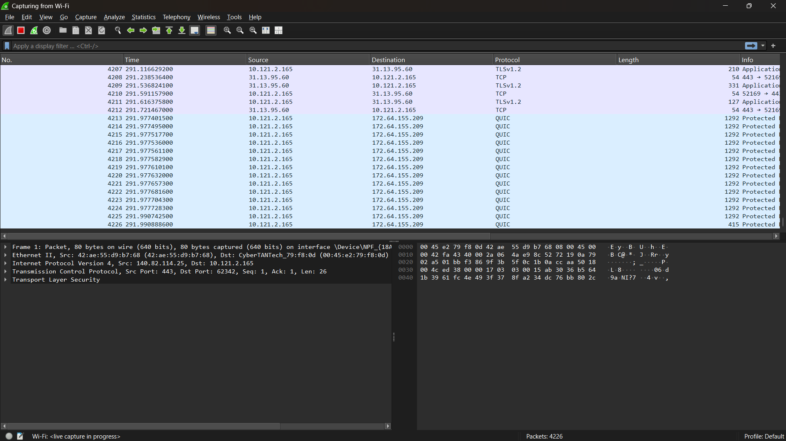
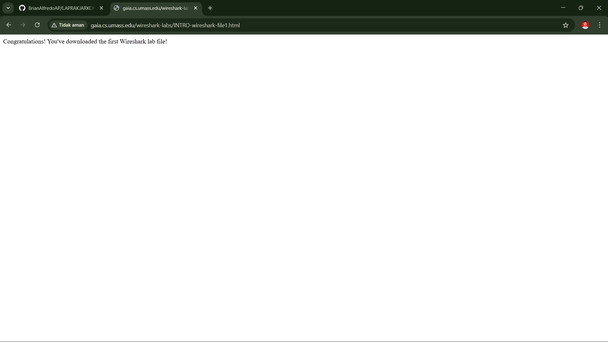

# Laporan Praktikum Jaringan Komputer

## Tujuan Praktikum
Installasi Wireshark dan Mempelajari Tools Wireshark

## Langkah Percobaan
1. Download Wireshark terlebih dahulu dengan menggunakan link berikut ini : [Download Wireshark](http://www.wireshark.org/)
2. Setelah downnload selesai lakukan installasi Wireshark di laptop
3. Tampilan awal masuk akan seperti gambar berikut ini:
   
4. Karena laptop saya terhubung ke internet menggunakan Wifi, maka interface yang saya pilih di Wireshark adalah Wifi. Interface ini saya pilih agar semua paket data yang masuk dan keluar melalui jaringan Wifi dapat ditangkap dan dianalisis oleh Wireshark.
5. Setelah memilih interface Wifi dan memulai proses capture, Wireshark mulai menampilkan paket data yang masuk dan keluar dari laptop saya secara real-time.
   
6. Untuk langkah percobaan masuk ke dalam browser lalu paste URL berikut ini :
   [Contoh URL percobaan](http://gaia.cs.umass.edu/wireshark-labs/INTRO-wireshark-file1.html)
   
7. Masuk kembali ke Wireshark, lakukan pencarian dengan filter http. Kemudian akan terlihat beberapa protokol http yang dapat kita lihat, pilih yang ada kata "200 OK (text/html)
   
   Pada bagian Line-based text data: text/html, Wireshark menampilkan isi data dari http. Data tersebut merupakan isi halaman web,yang berisi pesan “Congratulations! You've downloaded the first Wireshark lab file!” yang menunjukkan bahwa halaman web berhasil dimuat.

## Terima Kasih